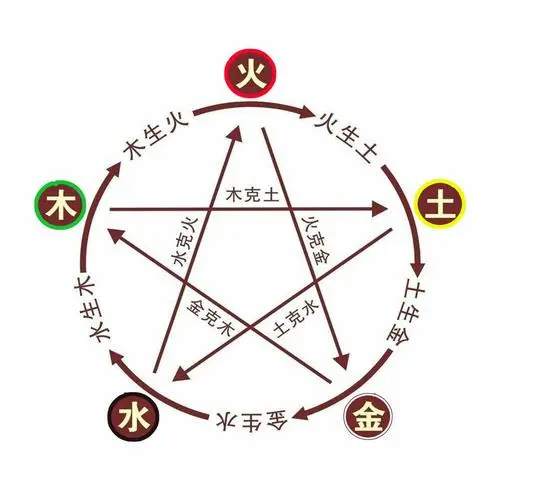

# 五行
## 一、五行的基本概念
`木`：木代表生之气，具有生长、向上、生发、生机等特点，所以凡是具有这类特性的事物或现象，都可归属于“木”，也包括各种植物本身及相关事物。

`火`：火代表热之气，具有温热、光辉、热情、能量等特性，所以凡是具有这类的事物或现象，均可归属于“火”，也包括各种火本身及相关事物。

`土`：土代表中和之气，是世界万物和人类生存之本，具有生化、承载、包容、受纳的特性，所以凡具有这些特点的事物或现象，皆归属于“土”，也包括土本身及相关事物。

`金`：金代表降之气，具有清洁，肃降、收敛、致密等特性，所以凡是具有这类性能的事物或现象，均可归属于“金”，也包括各种金属本身及相关事物。

`水`：水代表寒之气，具有滋润、下行、寒凉、闭藏、流动等特性，所以凡是具有这类特性的事物或现象都可归属于“水”。

## 二、五行相生
五行的相生顺序为木生火、火生土、土生金、金生水、水生木（如图所示）。

具体记忆要点如下：

1、`木生火`：以前做饭的时候，都是用柴火来生火的。

2、`火生土`：火把木头或是其它物质烧成了灰，这个灰落入大地，就变成了土。

3、`土生金`：金、银、铜、铁等各种金属矿物质，基本上都是埋在土里的。

4、`金生水`：这个可以从两个方面去联想和记忆，一是在高温下，金属会变成液态水状.

5、`水生木`：这个比较好理解，任何植物离了水，都不可能生长。

## 三、五行相克  

五行相克的顺序为`木克土、土克水、水克火、火克金、金克木`，按照上图的顺序，`顺位相生，隔位相克`。

相克的记忆要点如下：

1、`木克土`：木要以吸收土地里的营养为生。

2、`土克水`：当水泛滥成灾时，用土筑起堤坝才能治得住水。

3、`水克火`：水是火的克星。

4、`火克金`：金属再坚硬，只是火的温度足够，也会被融化。

5、`金克木`：砍伐木头、切割木材时，都是用金属做成的刀斧等工具。

## 四、五行所属颜色

1、`木为青色`：植物都是以绿色为主。

2、`火为赤色`：火、太阳等都是以红色、赤色为主。

3、`土为黄色`：中华文明的起源地是中原地区，那里的土地以黄色为主。

4、`金为白色`：大部分金属的颜色，以银白色为主。

5、`水为黑色`：比较深的水，比如江河湖海，看起来颜色都是黑色或是深蓝色。

## 五、五行阴阳

`木和火为阳`：木和火的特点是向上的、是温热的，所以属阳。

`木为少阳`，因为木还处于阳气上升的阶段；`火是老阳`，因为阳气已经升到了极致，即将下降转阴。

`金和水为阴`：金水的特点是向下的，寒凉的，所以属阴。

`金为少阳`，因为金之阴气只是处于下降阶段，还没达到最低；`水是老阴`，因为阴气已经降到了极致，即将上升转阳。

`土是中气`，因为地球上所有的物质都要立足于土，土要承载所有物质，所以土是阴阳均有。

## 六、五行所属方位

`东方属木`：太阳每天从东方升起，上升正是木的特性。

`南方属火`：每天中午太阳到了大概正南时，是一天气温最高的时候，南面也是咱们常说的阳面，房子朝南才有阳光、才暖和，这是火的特性。

`西方属金`：太阳每天从西方落下，肃降是金的特性。

`北方属水`：北面是阴面，朝北的房子永远看不到太阳，更阴凉，这是水的特性。

`中央属土`：土要承载其它四种五行，所以居于中央。

## 七、五行所属季节

`春季属木`：春天是万物开始生发的季节，符合木的特性，所以属木。

`夏季属火`：夏天最热，符合火的特性，所以属火。

`秋季属金`：秋天气温开始下降，万物开始收敛，符合金的特性，所以属金。

`冬季属水`：冬季最寒，属于水的特性，所以属水。

`四季中都有土`：四季中没有专门代表土的季节，因为不管那个季节都需要土。

## 八、五行所属器官

`肝木`：木代表肝、胆、筋骨、四肢。记忆时先记住肝属木，联想记忆，肝同树干的干；记住了肝，再记胆，记住一个词，肝胆相照，它们两个是互为表里；然后再记筋骨、四肢，可以这样联想，筋骨四肢都是细长的形态，正是木头及枝杈的形状。

`心火`：火代表心脏、小肠、血脉循环系统。记忆时先记住心属火，可以这样联想记忆，火代表能量，而人体的能量源泉，来自于心脏，然后血脉循环系统是从心脏延伸出来的；至于小肠，可以这样联想，大家学说小心小心，所以心和小肠是互为表里。

`脾土`：土代表脾、胃、消化系统。这个比较好记，因为大家都知道，脾胃和消化系统是一体的，然后记忆时这样联想：土的特点是包容、容纳，而脾胃消化系统的特点也是容纳，容纳各种食物。

`肺金`：金代表肺、大肠、呼吸系统。记忆时先记住肺属金，可以这样联想，肺金=费劲；而肺和呼吸系统是一体的，这个自然也就记住了；大肠可以这样联想，大肠就是肥肠，而肥字谐音就是肺，所以肺和大肠是互为表里的。

`肾水`：水代表肾、膀胱，泌尿系统，这个最好记，这几个器官大家都知道，是与尿液有关的器官，而尿液属水。

## 九、五行所属五官

`目属木`，因为肝开窍于目。这个最好记，目同木。

`舌属火`，因为心开窍于舌。可以这样联想记忆，心火大时，舌头爱起泡。

`口属土`，因为脾开窍于口。可以这样联想记忆，脾胃属土，而往胃里吃东西靠嘴。

`鼻属金`，因为肺开窍于鼻。可以这样联想记忆，肺属金，肺需要靠鼻子来吸气。

`耳属水`，因为肾开窍于耳。可以这样联想记忆，肾不好就容易耳鸣。

## 十、五行所属五常   

儒家有五常，`仁义礼智信`，这是儒家提倡做人的起码道德准则，也代表着五种不同的人性。五行所代表的五常为：

`木主仁`：木贡献了果实给我们做食物、贡献了躯干给我们做燃料、贡献了整个身体给我们做成各种日常用品，非常仁爱。

`火主礼`：因为火代表文明，人类从学会使用火之后，才开始慢慢进入文明社会。而文明的人，都是彬彬有礼的。

`土主信`：信通俗的说就是守信，实在。五行中土最实在，八字中土多的人也往往比较实在。因为土承载了地球万物、孕育了地球万物，其中四种五行，也都是需要土来承载。

`金主义`：金代表各种兵器，再延伸代表士兵、军队，而这些都是用来维护正义的。

`水主智`：水是五行中最没有伤害性的，而且也不争锋，永远是向下流，遇到走不通的路就变道，非常变通。