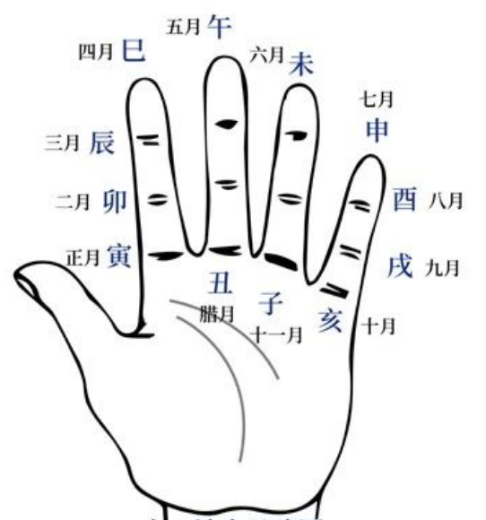
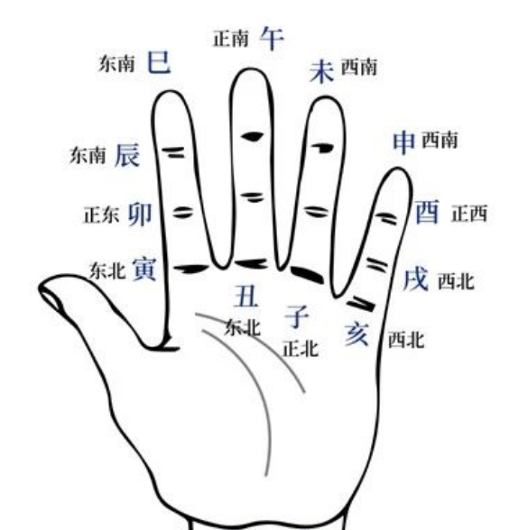
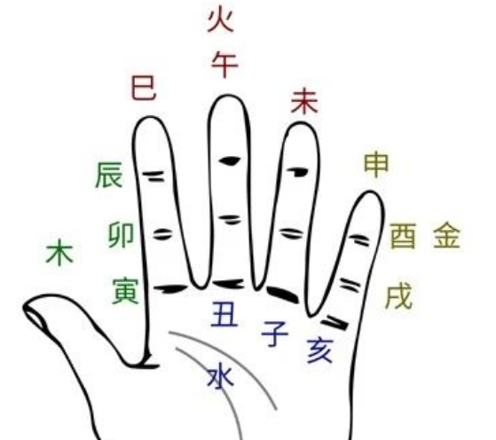
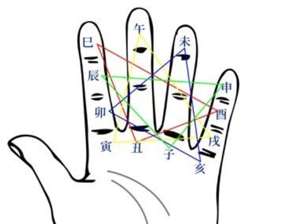
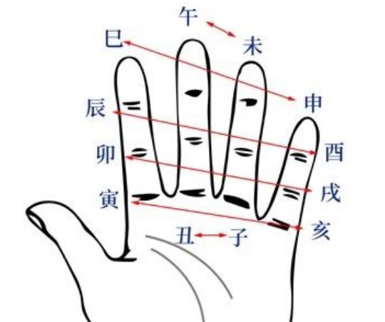
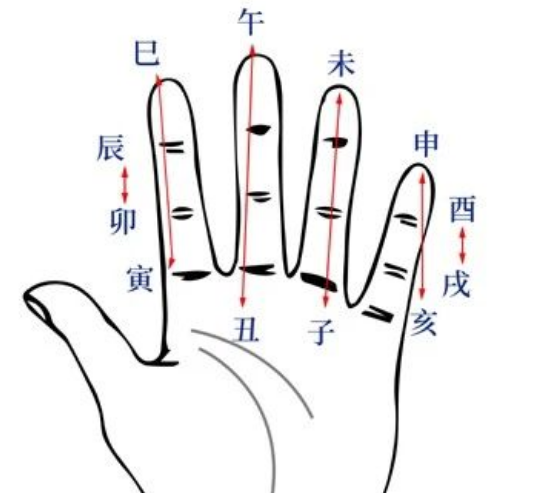

# 十二地支

## 一、十二地支

十二地支为：`子、丑、寅、卯、辰、巳、午、未、申、酉、戌、亥`

记十二地支时，一定要配合掌诀图，因为结合掌诀图各种地支关系记起来更快，在应用时，也方便查阅。十二地支的基本掌诀图如下：以左手无名指根为子，然后按顺时针方向排列。 

                         
## 二、十二地支代表的生肖

十二地支与十二生肖对应的组合为：`子鼠、丑牛、寅虎、卯兔、辰龙、巳蛇、午马、未羊、申猴、酉鸡、戌狗、亥猪`

如果记不住，可以这么联想，首先每组生肖的谐音为：子鼠（紫鼠）、丑牛（丑牛）、寅虎（银虎）、卯兔（毛兔）辰龙 (成龙，著名影星)、巳蛇（死蛇）、午马（午马，和成龙同时代的著名香港演员，）、未羊（喂羊）申猴（身后），酉鸡（有鸡）、戌狗（虚构）、亥猪（害猪）。

两两组合起来为：紫鼠爱丑牛，银虎爱毛兔，成龙打死蛇，午马去喂羊，身后只有鸡，虚构想害猪。

具体含义为：

`紫鼠爱丑牛`：紫色的老鼠爱上了长的很丑的牛。

`银虎爱毛兔`：银色的考虑爱上了毛很长的兔子。

`成龙爱死蛇`：明星成龙爱死了蛇。

`午马爱喂羊`：演员午马就爱喂羊。

`身后只有鸡`：看看人家都有爱的人，但是你却没有爱人，为啥？因为你穷，只剩下身后的一只鸡。

`虚构大海猪`：你怕别人笑话你啥都没有，于是你虚构说，你特别爱养猪，你是养猪能手，你养了一只像海一样大的猪，卖了就是万元户。

## 三、十二地支对应的月份    

虽然十二地支的顺序是从子开始，但是代表一月（农历）的是寅

具体为：寅，正月；卯，二月；辰，三月；巳，四月；午，五月；未，六月；申，七月；酉，八月；戌，九月；亥，十月；子，十一月；丑，十二月。

具体记忆时，配合掌决图记忆会更好，具体如下图：食指指根为寅，为正月，然后按照顺时针排。

## 四、十二地支对应的季节
寅卯辰为春季。因为寅卯辰为农历的一、二、三月，是春天的月份。

巳午未为夏季。因为巳午未为农历的四、五、六月，是夏天的月份。

申酉戌为秋季。因为申酉戌为农历的七、八、九月，是秋天的月份。

亥子丑为冬季。因为亥子丑为农历的十、十一、十二月，是冬天的月份。

## 五、十二地支对应的五行
一年十二个月后，每个季节前两个月的五行为本所属五行，每个季节的最后一个月五行固定为土。

具体为：寅卯（一二月）为木，辰（三月）为土巳午（四五月）为火，未（六月）为土申酉（七八月）为金，戌（九月）为土亥子（十和十一月）为水，丑（十二月）

为土为什么每个月的最后一个月为土呢？因为每个季节都不能完全代表土，但每个季节、每种五行却都离不开土，地球万物都需要土来承载，所以每个季节的最后一个月为土。

## 六、十二地支对应的方位

子属水为正北，午属火为正南，卯属木为正东，酉属金为正西，所以子午卯酉也叫四正之位。

为什么这四个地支代表正位呢？因为这四个地支在十二长生中，是金水木火四个阳五行的帝旺之地，气最足。

丑、寅为东北，辰、巳为东南，未、申为西南，戌亥为西北。

配合掌诀图记忆十二地支方位很容易，具体参看下图。

## 七、十二地支的阴阳属性

同十天干一样，地支也是单数为阳，双数是阴，即：子寅辰午申戌，为阳；丑卯巳未酉亥，为阴。

## 八、十二地支三会   

地支三会，可以理解为三个地支团结在一起，一致对外。**`当三者同时出现时，会加强某种五行的力量`**，地支三会局一共有四组，分别为：    

`寅卯辰会木`。当寅卯辰三个一起出现时，会加强木的力量，因为寅卯辰为春季，而春季五行属木，所以寅卯辰会木。    

`巳午未会火`。当巳午未三个一起出现时，会加强火的力量，因为巳午未为夏季，而夏季五行属火，所以巳午未会火。

`申酉戌会金`。当申酉戌三个一起出现时，会加强金的力量，因为申酉戌为秋季，而秋季五行属金，所以申酉戌会金。

`亥子丑会水`。当亥子丑三个一起出现时，会加强水的力量，因为亥子丑为冬季，而冬季五行属水，所以亥子丑会水。

配合掌诀图记忆的话，就是左手掌左边的三个五行会木，上边的三个五行会火，右边的三个五行会金，下边的三个五行会水。

## 九、十二地支三合

地支三合与地支三会很像，也是三个地支团结在一起，三者同时出现时，会加强某一种五行的力量。但是,**`三合局没有三会局力量大`**，因为三会局是三个五行属性趋于相同的地支会在一起。

比如寅卯辰会木，寅属木、卯也属木，辰虽然属土，但辰是农历三月，是春天的土，而春季五行属木。这就相当于三个亲兄弟凑到一起做事，自然更默契、更团结，发挥出的力量更大。

而三合局是三种属性完全的不同的地支合在了一起，比如寅午戌合木，寅属木、午属火、戌属土，戌是农历九月，还是秋天的土。这就相当于一个亚洲人、一个非洲人、一个欧洲人凑在一起做事，虽然看着是一伙的很团结，但是由于文化、语言、思想等方面的差异，默契度等肯定不如前面的三兄弟，所以发挥出来的力量也要较之小一些。

地支三合局也同样是有四组，分别为：

**`寅午戌合火`**：寅午戌三个一起出现会加强火的力量，因为在五行十二长生中，寅是火的长生之地、午是火的帝旺之地、戌是火的入墓之地。

**`巳酉丑合金`**：巳酉丑三个一起出现会加强金的力量，因为在五行十二长生中，巳是金的长生之地、酉是金的帝旺之地、丑是金的入墓之地。

**`申子辰合水`**：申子辰三个一起出现会加强水的力量，因为在五行十二长生中，申是水的长生之地、子是水的帝旺之地、戌是水的入辰之地。

**`亥卯未合木`**：亥卯未三个一起出现会加强木的力量，因为在五行十二长生中，亥是木的长生之地、卯是木的帝旺之地、未是木的入墓之地。

结合掌诀图记忆，具体记忆规律如下：

1、三合局的第一个字，都是以掌诀图中按顺时针每一边的第一个字，也就是四个角的那四个字，即：寅巳申亥。

2、第二个字是按顺时针第一个字下一个方位的第二个字，第三个字是再下一个方位的第三个字。比如寅午戌，寅是按顺时针左边的第一个边，午是上边的第二个字，戌是右边的第三个字。

3、三合局合后的五行，是每组三会局中间那个字的五行。比如寅午戌合火，因为中间的午字属性是火。

## 十、十二地支半合

地支半合是基于地支三合来的，地支三合是三个字组合在一起。而当缺了一个字，只有两个字时，就称之为半合，**`半合的力量要小于三合`**。

比如寅午戌三个字在一起，是三合；如果只有寅午，或者只有午戌，就叫半合。这里要注意，**`半合必须是包含中间那个字`**：寅午、午戌可以叫半合，因为包含了中间的午字，但是如果是寅戌，就不能叫半合了。

为什么缺了中间的字就不行呢？

因为如果这三个字是一个小团队的话，中间那个字就是领袖、是灵魂，另外两个字就是兵丁。少一个兵，这个团队还可以做事，只不过力量能小一些，但是没了领袖，就彻底玩不转的。比如寅午戌三合，合起来是加强火的力量，火是灵魂，而少了中间的午，还怎么完成合火的这个目标呢？

## 十一、十二地支六合

地支六合，是指每两个地支为一组，这两个地支相互团结在一起，并加强某种五行的力量。具体为

**`子丑合化土，寅亥合化木，卯戌合化火，辰酉合化金，巳申合化水，午未合化土`**

记忆时，结合掌诀图很简单，就是掌诀图中左右两个相对称的五行相合，

如下图所示。合化后的五行顺序，按照掌诀图的顺序为上下两组为土，然后中间四组从下到上为木、火、金、水。这四组的关系是相生的，木生火，金生水。

午未合 化 土

巳申合 化 水

辰酉合 化 金

卯戌合 化 火

寅亥合 化 木

子丑合 化 土

不过这里要注意，地支相合并不是说相合后就改变自身五行属性了，比如说午未合化土，并不是说二者就变成土了。

## 十二、十二地支六冲

相冲的意思简单的说就是相战、打架，

地支相冲一共有六组，所以叫六冲，具体为：

**`子午相冲，丑未相冲，寅申相冲，卯酉相冲，辰戌相冲，巳亥相冲`**

地支六冲很好记，因为相冲的二者在位置上正好是掌决图中相对的位置，如下图所示

## 十三、十二地支六害
    相害通俗的说就是伤害、损害、加害的意思，因为相害的两个地支，在掌决图中都是上下对应的，所以地支相害又叫地支相穿。

地支相害是从地支六合及地支六冲来的，同样也是六组，他们的寓意分别为：

**`子未相害`**：未要和午相合，但是子却来冲午，让未和午合不了，坏了未的好事。

**`午丑相害`**：丑要和子相合，但是午却来冲子，让丑和子合不了，坏了丑的好事。

**`寅巳相害`**：巳要和申相合，但是寅却来冲申，让巳和申合不了，坏了巳的好事。

**`辰卯相害`**：辰要和酉相合，但是卯却来冲酉，让辰和酉合不了，坏了辰的好事。

**`申亥相害`**：亥要和寅相合，但是申却来冲寅，让亥和寅合不了，坏了亥的好事。

**`酉戌相害`**：戌要和卯相合，但是酉却来冲卯，让戌和卯合不了，坏了戌的好事。

地支六害配合掌诀图记忆也非常简单，就是掌诀图中，上下对称的两个地支为相害。如下图所示。

## 十四、十二地支相刑
相刑，通俗的说就是刑伤，牢狱，病灾，官讼等方面的意思。地支相刑有七组，分别

**`子卯相刑、寅巳申三刑、丑未戌三刑、辰辰刑，午午刑，酉酉刑，亥亥刑`**

其具体分类如下：

申刑寅、寅刑巳、巳刑申：为恃势之刑。

戌刑未、未刑丑、丑刑戌：为无恩之刑。

子刑卯、卯刑子：为无礼之刑。

辰刑辰、午刑午、酉刑酉、亥刑亥：为自刑。

具体记忆时，要点如下：

1、两个地支相刑的只有一组，即子卯相刑，你可以这样记，子是十二地支当中的老大，只有一个地支改和他刑战，就是卯。

2、三个地支相刑的有两组。一是寅巳申三刑，这组刑的字，就是掌诀图中四个角的那四个字：寅巳申亥中去掉亥。你可以这样记，亥是十二地支中最小的一个，因为他小，所以不敢打群架。

3、十二地支中有四个地支的五行属土，分别是辰未戌丑，第二组三刑就是四个土中去掉辰，即丑戌未。你可以这样记，辰对应的生肖是龙，龙很高贵，也很厉害，不屑于和它们打群架。

4、除了以上三组，还有四个字没有出现，这四个字就是自己和自己较劲，自己和自己打架，就是辰辰自刑、午午自刑、酉酉自刑、亥亥自刑。

## 十五、十二地支相破

相破通俗的说就是破坏，一共也有六组。分别是：

子酉相破、卯午相破、寅亥相破、巳申相破、辰丑相破、戌未相破。

记忆的要点如下：

1、子酉破、卯午破是从十二长生中四长生来的，即“子午卯酉”，规律是头尾相破，中间相破。即头子和尾酉相破，中间的午和卯相破。

2、寅亥破、巳申破是从12长生中四桃花来的，即“寅申巳亥”，规律也是头尾相破，中间相破。

3、辰丑破、戌未破是从12长生中四墓库来的，即“辰戌丑未”，规律是隔位相破。