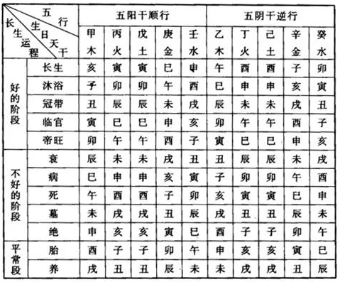

# 十二长生

## 一、十二长生含义

十二长生是指十天干运行于不同的十二地支时，表现出来的不同状态，用来比喻天下万事万物产生、发展、衰败消亡的整个过程。

十二长生具体名称及寓意如下：

**`长生`**：就像人刚出生时的状态，一段新的人生开始启程，充满生机和希望。

**`沐浴`**：沐浴字面意思是说出生后，进行沐浴，清除污垢之意，实际上就是指人的婴幼儿这个阶段。沐浴又叫败地，是因为在这个阶段，非常容易生病、甚至夭折。尤其是在建国以前，医疗和卫生条件不好，所以婴儿的死亡率很高。沐浴又称为桃花之地，是因为在古时候，一个人洗澡时，如果被别人看到了身体或一部分，就是要嫁娶的，所以沐浴又叫桃花之地。

**`冠带`**：是指人茁壮成长的这个阶段，也就是儿童到少年的这个阶段。

**`临官`**：是指人长大成年，开始工作这个阶段。此时正处于走上坡路的阶段，身体健康、精力旺盛、冲劲十冲。

**`帝旺`**：是指人的身体和事业达到巅峰这个阶段，功成名就、如日中天、登峰造及。

**`衰`**：人过了中年以后，身体开始走下坡路这个阶段。正所谓盛极而衰，物及必反，过了巅峰就是下坡路。

**`病`**：是指人衰老之后，身体开始频繁出问题生病这个阶段。

**`死`**：生命走到了终点。

**`墓`**：人死之后，都要入墓。墓也叫库，因为对于人来说，死了是入墓，但是对于植物来说，比如木头，消亡了之后不是入墓，而是要放入仓库。

**`绝`**：入墓后，并没有彻底灭绝，因为还有躯体在。而在入墓一段时间之后，躯体和大地彻底融为一体，才是真正的形神绝灭。

**`胎`**：生命重新开始结胎，进入下一个轮回。

**`养`**：是指在胎中蓄养的阶段。

## 二、十二长生速查表

**`甲丙戊庚壬`** 五个阳天干的十二长生是按照顺时针来排列，

**`乙丁己辛癸`** 五个阴天干的十二长生是按照逆时针来排列，

具体排列顺序请参看下面十二长生速查表：

甲木的长生在亥，丙火和戊土的长生在寅，庚金的长生在巳，壬水的长生在申。

乙木的长生在午，丁火和己土的长生在酉，辛金的长生在子，癸水的长生在卯。

## 三、记忆阳天干十二长生

先记住五个阳天干的长生位置，记忆的时候，配合掌诀图效果更好。**`五个阳天干的长生之地，在掌诀图四个角的位置，也就是“寅申巳亥”这四个地支，所以这四个也叫四长生之地。`** 具体每个阳五行的长生之地记忆要点如下：

1、甲木的长生在亥。因为甲木代表参天大树，大树的种子是在冬天开始孕育，虽然立春后才从地下冒出来，但是从内部发芽孕育的时候却是在亥月（农历十月），所以甲木长生在亥。

2、丙火的长生在寅。因为丙代表太阳，立春后的寅月（农历正月），春天来临，天气开始转暖，太阳开始慢慢发威，所以丙的长生在寅。

3、戊土的长生在寅。因为没有专门代表土的季节，而火能生土，所谓子凭母贵，所以戊的长生也在寅。从另一个角度说，春天来了，土地开始孕育万物，才能发用，所以从这一点来说，也是长生在室内。

4、庚金的长生在巳。因为庚金代表刀斧，而刀斧是由铁经炉火锻造而成。而代表火的地支有两个，巳和午，而火午比午火更实，更能代表锻铁的炉火，所以庚金的长生在巳。

5、壬的长生在申。壬水代表大江大河，中国的主要河流，都是起源于西部，尤其是偏南的位置，而西方为金，申的方位为西方偏南。从季节上说，申为农历七月，是秋天的开始，所谓秋水泛滥，这个时节容易下雨频繁河水暴涨。综上两点，壬水长生在申。记住了长生之地后，再在手掌上按照顺时针顺序排就开始了。

## 四、记忆阴天干十二长生的方法

**`阴天干的长生之地，就是阳天干的死地，这就是所谓的阳极阴生；而阴天干的死地，也是阳天干的长生之地，这是所谓的阴极阳生。`** 具体为：

乙木的长生在午，这是甲木的死地；

丁火和己土的长生在酉，这是甲木的死地。

辛金的长生在子，这是庚金的死地；

癸水的长生在卯，这是壬水的死地。四个死地为“子午卯酉”，

这四个位置是阳天干的沐浴之地，所以这四个也叫四败之地，或是四桃花之地。