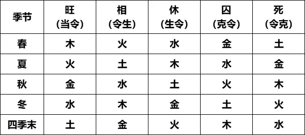

# 五行四季旺衰

## 一、五行四季旺衰的意思和作用

五行四季旺衰，是指一种五行在不同季节中的力量强弱。因为在用八字、六爻等命理术数断命时，主要是通过对比命盘中五行力量的强弱来分析命运，而五行四季旺衰，是判断五行力量大小最重要的依据。

## 二、五行四季旺相休囚死速查表

根据季节的不同，五行会呈现出 **`旺、相、休、囚、死`** 五种不同的状态。

旺为力量最强，相次之，休再次，

囚的力量很弱，死基本上就没什么力量了，详情参看下面的五行四季旺相休囚死速查表。

具体的判断口诀为： **`当季者旺，季生者相，季我者旺，克季者囚，季克者死`** 。这段口诀是什么意思？具体记忆要点如下。     

三、五行四季旺衰的记忆要点

**`当季者旺`** ：**意思是正处于本五行所属的季节，则力量最强、最旺**。比如夏季属火，所以火在夏季就是旺。

**`季生者相`** ：相，可以理解为丞相。在古代，除了皇帝丞相最大，在此是指力量排第二的意思。**被当季节所生的五行即为相，力量仅次于旺，为第二强**。比如火生土，所以在夏季，土就是为相。

**`生季者休`** ：**休是休息的意思，为力量第三强，生扶当季五行的即为休**。比如木生火，所以在夏季，木就是为休。为什么要休息？因为木已经很强了，已经是最大了，不需要再生扶它了，可以休息一下了。这就好像一个人，辛苦把孩子抚养成人，孩子长大后成才了，不需要父母帮扶了，父母可以好好歇歇了。五行在此时的状态，基本上就是处于虽然还有力量，但是却不能有大的作为，只能保持自己生存的状态。

**`克季者囚`**：囚，就是囚禁的意思。**如果五行处于囚的状态，基本上力量就很弱了**，就好像一个人被控制了起来，失去了自由，发挥不了太大作用。克制当季五行的为囚，比如水克火，所以火在夏季为囚。这就好像一个恶霸以前总欺负一个人，当这个人当上国王时，肯定要把这个恶霸囚禁起来收拾他。

**`季克者死`**：死就是灭亡的意思。**如果五行死于死的状态，基本上就是没什么力量了。被当季五行克制的为死**，比如火克金，所以金在夏季为死。被克者可以理解为你的敌人，当一个人当上国王时，肯定要把敌人灭掉。

在这里要特别注意一点，**死只是说力量死了，并不是说这种五行死了、消失了、没有了，五行还在，只是没什么力量了**。

另外大家可能会发现一个问题，就是四季中没有代表土的季节，那么土在那个季节是旺呢？江阳君在前面的文章曾经分享过，这是因为不管那个季节都需要土，所以古人云“土旺于四季”，所以每个季节的最后一个月为土月，**土在每个季节的最后一个月为旺，也就是上表里的“季末”**。

## 四、同一季节的力量也不同

在具体判断时还有一点要注意，在同一个季节中，当季五行在不同月份的力量也是有强弱之分的。简单的说，**`每个季节的第二个月最旺，第一个月次旺，第三个月再次`**。比如夏季的三个月为巳午未，火在午月的力量最强，巳月次之，未月再次。

这是因为每个季节的第二个月是节气最盛之时，气最纯，所以力量最强；第一个月是力量开始上升之时，但是还没达到顶点，气有些杂，所以次之；第三个月季节就要过去，开始退气，而且这个月五行属土，气杂，所以再次。