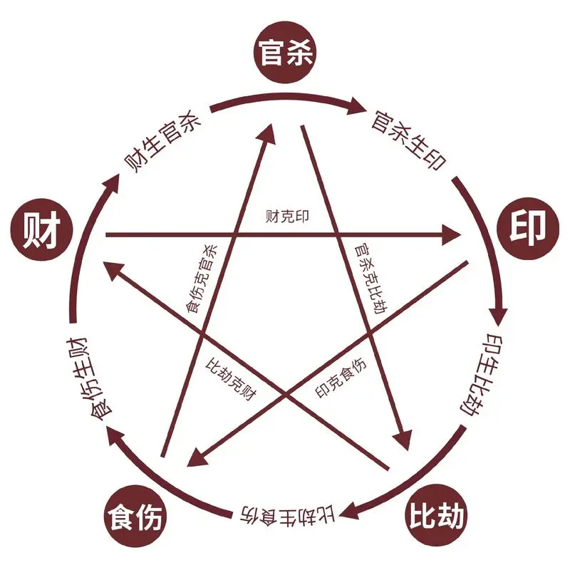

# 十神生克

## 一、十神名称及记忆要点

八字的十神为五组，每组两个，分为

**`财（分为正财与偏财）、官杀（分为正官与七杀）、印（分为正印与偏印）、比劫（分为比肩与劫财）`**

一个八字中具体有那些十神关系，是以八字中日干代表“我”，也就是自己，然后用日干与其它五行的生克来确定十神关系。具体记忆要点如下：

**`我克者为财`**：因为克制你也可以理解成控制之意，而财物正是被你控制之物中最重要的东西，因为财是人活于世的立命之本，所以我克者为财。如日干为甲木，则遇戊己土为财。

**`克我者为官杀`**：克制可以理解为约束、管控。而人生在世，对你管控力最大的就是官府，所以克我者为官杀。如日干为甲木，则遇庚辛金为财。

**`生我者为印`**：生我即是帮助我，人生最理想的状态莫过于一生下来有祖荫、人生路上有福荫、遇到困难有遮荫。而印通荫，所以生我者为印。如日干为甲木，则遇壬癸水为印。

**`同我者为比劫`**：同我是指与我五行相同，也就是同出一源。这种关系最直接的就是兄弟姐妹。比劫是比肩和比肩的合称，比肩你可以理解成是并肩的意思，兄弟姐妹能够并肩携手时，是最理想的状态。而如果兄弟姐妹关系不好，就可能相互争夺家产和利益，这就成了你的劫财。所以同我者为比劫。如日干为甲木，则再遇甲木为比劫。

**`我生者为食伤`**：孩子为我生，而且是人生中最重要的人之一。食伤是食神和伤官的合称，你生了孩子后，还要养育他，孩子要食你的、穿你的，所以为食神；对于孩子来说，你是约束他的人，所以为他的“官”，但是如果孩子不孝顺和听话，就会伤了你这个“官”，所以就成了伤官。所以我生者为伤官。如日干为甲木，则遇丙丁火为食伤。

## 二、十神相生相克关系

**`印生比劫`**：比劫是我的兄弟姐妹，与我同样享受父母庇荫，所以印生比劫。

**`比劫生食伤`**：食伤是孩子，长辈对晚辈要庇护，所以比劫生食伤。

**`食伤生财`**：人老了要靠孩子赡养，要花孩子的钱财；从另一个角度理解，食伤也代表能力，而赚钱要靠能力，所以食伤生财。

**`财生官杀`**：官杀代表官府、国家，国家富强了，人民才能幸福；从另一个角度理解，钱多了容易生事端，所以财生官杀。

**`官杀生印`**：国家强大了，才能更好的庇护人民，给人民带来福荫，所以官杀生印。

十福相克的顺序，与五行相克的顺序一致，都是隔位相克，记忆要点为：

**`比劫克财`**：最直接和我争夺祖上产业的就是兄弟姐妹，所以比劫克财。

**`财克印`**：古代的官吏，必须要有印绶来代表身份级别以及证明其合法性，因此印也代表权威。而权力最容易被金钱腐蚀，所以财克印。

**`印克食伤`**：食伤代表能力、想法、行为，印代表文化道德，而文化道德会在一定程度约束和规范人的思想和行为，所以印克食伤。

**`食伤克官杀`**：官杀代表各种问题和困难，而人生路上想克服各种问题和困难，首先要靠自己的能力；从另一个角度理解，为自己养老送终是人生最终要解决的问题，而这些要靠子女解决，所以食伤克官杀。

**`官杀克比劫`**：有人要夺我的财，找谁做主？当然是找官府做主。所以官杀克比劫。

## 三、财

**`财代表一切你能够克制和支配的事物或现象`**，比如金钱、产业、财物、收入、珠宝等。财分为正财、偏财，

其中与日干阴阳属性 **`不同者为正财，相同者为偏财`**

比如日干是甲，则戊干为偏财，己土为正财。之所以这么分，因为命理学实际上是中国古代哲学的体现，中国哲学讲究的是天人合一，阴阳平衡。所以与日干五行不同者，能够相互调和平衡，所以为正，同性者阴阳不调，所以为偏。其它十神的分法原理相同。

**`正财主要代表正统途径获得的财物`**，比如工资；偏财主要代表非正统途径获得的财物，比如彩票奖金。

在六亲关系上，**`对于男性，财还也代表妻子和情人`**。为什么用财来代表妻子？因为在古人的认知里，妻子是被丈夫所拥有。偏财还代表父亲，因为在古代，男性主外赚钱养家，女人主内育儿持家，而我们能够得到父亲赚来的财物，但是这个财物又不是能够自己努力赚来的，所以 **`父亲为偏财`**

## 四、官杀

**`官杀代表一切能够克制你的、制约你的、给你造成压力、给你造成困扰的事物或现象`** 。比如伤灾、官司、官府、官位、职位、地位、权威、领导、事业、法律、自控能力等。

**`官分为正官、七杀（也叫偏官），其中与日干阴阳不同者为正官，相同者为七杀。`**

比如日干是甲，则辛金为正官，庚金为七杀。正官代表的含义更温和一些，比如自制力、良性限制、名声、权力、职位、官位、文职等；七杀代表的含义更激进一些，比如偏激、敌人、小人、暴徒、武职、强制、伤灾、官司、牢狱等。

**`在六亲关系上，对于女性业说，官杀代表丈夫`** ，因为古时候讲究以夫为纲，妻子是要被丈夫管制的。另外对于男性，官杀还代表孩子，因为养孩子是一件压力很大的事。通常 **`正官为女孩、七杀为男孩`**

## 五、印

**`印代表一切庇护你的、生养你的、对你有帮助的事物或现象`** 。比如房屋、交通工具、工作、单位、权力、名誉、地位、职位、证件、书本、知识、文化、学业、靠山、老师等。

**`印分为正印、偏印（也叫枭神），其中与日干阴阳不同者为正印，相同者为偏印`**。

比如日干是甲，则癸水为正印，壬水为偏印。正印代表正业，比如本职的工作、职位、正统的行业等；偏印代表偏业，比如兼职、副业、非主流的行业等。

**`在六亲关系上，印代表母亲`**，因为是母亲生你育你，是你的庇护者。**`偏印代表继母、养母`** 等。

## 六、食伤

**`食伤代表一切受你生养庇护、能让局主开心的事物或现象`** ，比如才华、才艺、能力、口福、福寿、食禄、娱乐、运动、财源、口才等。

**`食伤分为食神、伤官，其中与日干阴阳相同者为食神，不同者为伤官`** 。

比如日干是甲，则丁火为伤官，丙火为食神。食神比较温和一些，比如才华横溢、心态乐观，与世无争等；伤官比较激进一些，比如内心矛盾、欲望强烈永不满足、说话得罪人、标新立异。

**`在六亲关系上，食神还代表子女`**，因为食伤为我生，女子也是为我生。其中 **`食神通常为女儿，伤官通常为儿子`**。

## 七、比劫

**`比劫代表一切能够与你同源、同类、分担、帮助、合作的事物或现象`** ，比如朋友、同事、同学、同行、战友、合作伙伴、竞争对手等。

**`比劫分为比肩、劫财，其中与日干阴阳相同者为比肩，不同者为劫财`**

比如日干是甲，则甲木为比肩，乙木为劫财。比肩比较温和一些，比如帮助、助力、良性竞争、对我有益的人等；劫财比较激进一些，比如小人、恶性竞争、对我有害的人等。

**`在六亲关系上，比劫还代表兄弟姐妹`**，因为比劫与日主为同出一源。对于男性，比肩为兄弟，劫财为姐妹；对于女性，劫财为兄弟，比肩为姐妹。