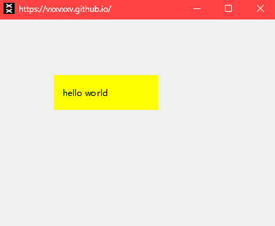
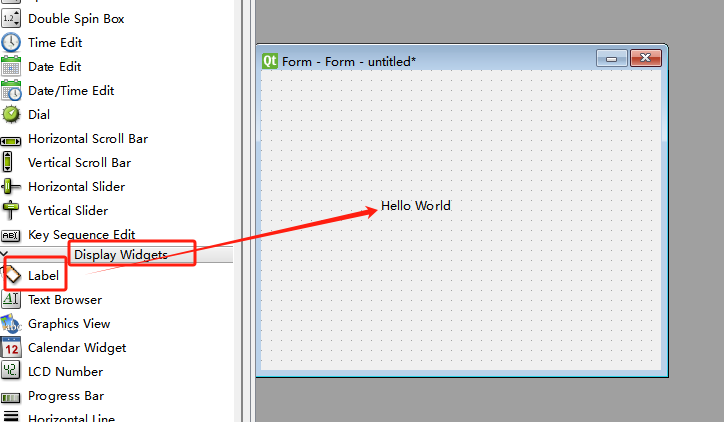
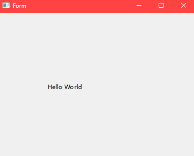

# PyQt6入门实例

QApplication专门为QGuiApplication提供基于QWidget 的应用程序所需的一些功能。它处理小部件特

定的初始化和结束；

QWidget类是所有 Qt GUI 界面类的基类；

sys模块是Python自带的模块，它是与Python解释器交互的一个接口。sys 模块提供了许多函数和变量

来处理 Python 运行时环境的不同部分；

##  Hello World实现



```python
from PyQt6.QtWidgets import QApplication, QWidget, QLabel
from PyQt6.QtGui import QIcon
import sys

def main():
    app = QApplication(sys.argv) # 创建一个应用
    window = QWidget()
    window.setWindowTitle("https://vxxvxxv.github.io/")  # 设置主窗口的标题为"派森斗罗"
    window.setWindowIcon(QIcon('../../public/yao.jpg'))  # 设置主窗口的图标为'logo.png'文件
    window.resize(400, 300)  # 主窗口大小，宽400，高300
    window.move(200, 400)  # 主窗口位置，x200，y400
    window.show()

    label = QLabel()  # 在主窗口上创建一个QLabel对象
    label.setText("hello world")
    label.move(80, 80)
    label.resize(150, 50)
    label.setStyleSheet("background-color:yellow;padding:10px")
    label.setParent(window)
    label.show()
    sys.exit(app.exec())  # 开始执行程序，并进入消息循环等待

if __name__ == "__main__":
    main()
```

##  窗口居中对齐

```python
import sys
from PyQt6.QtWidgets import QApplication, QWidget
from PyQt6.QtGui import QScreen, QGuiApplication
from PyQt6.QtGui import QIcon

class MyApplication(QWidget):
    def __init__(self):
        super().__init__()

        self.initUI()

    def initUI(self):
        self.setGeometry(0, 0, 300, 200)  # 设置主窗口的位置和大小，x坐标、y坐标、宽度、高度
        self.setWindowTitle("https://vxxvxxv.github.io/")
        self.setWindowIcon(QIcon('../../public/yao.jpg'))

        self.center()  # Center the window on the screen
    def center(self):
        qr=self.frameGeometry()
        cp=QGuiApplication.primaryScreen().availableGeometry().center()
        qr.moveCenter(cp)
        self.move(qr.topLeft())

if __name__ == '__main__':
    app = QApplication(sys.argv)
    ex = MyApplication()
    ex.show()
    sys.exit(app.exec())
```

## QTDesigner实现Hello World

上方导航栏中`Tools -> External Tools`进入`QTDesigner`，选择组件Display Widgets —> Label，输入Hello Wold，保存为helloworld.ui文件



选中helloworld.ui，使用上方导航栏中`Tools -> External Tools`进入`pyuic`，生成helloworld.py

补充main方法，实现调用。之后右键，运行。



```python
# Form implementation generated from reading ui file 'helloworld.ui'
#
# Created by: PyQt6 UI code generator 6.4.2
#
# WARNING: Any manual changes made to this file will be lost when pyuic6 is
# run again.  Do not edit this file unless you know what you are doing.
import sys

from PyQt6 import QtCore, QtGui, QtWidgets
from PyQt6.QtWidgets import QApplication, QWidget


class Ui_Form(object):
    def setupUi(self, Form):
        Form.setObjectName("Form")
        Form.resize(400, 300)
        self.label = QtWidgets.QLabel(parent=Form)
        self.label.setGeometry(QtCore.QRect(100, 100, 241, 101))
        self.label.setObjectName("label")

        self.retranslateUi(Form)
        QtCore.QMetaObject.connectSlotsByName(Form)

    def retranslateUi(self, Form):
        _translate = QtCore.QCoreApplication.translate
        Form.setWindowTitle(_translate("Form", "Form"))
        self.label.setText(_translate("Form", "Hello World"))

if __name__ == '__main__':
    app = QApplication(sys.argv)
    w = QWidget()
    Ui_Form().setupUi(w)
    w.show()
    sys.exit(app.exec())
```
