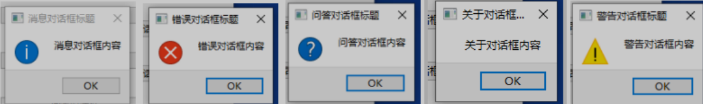
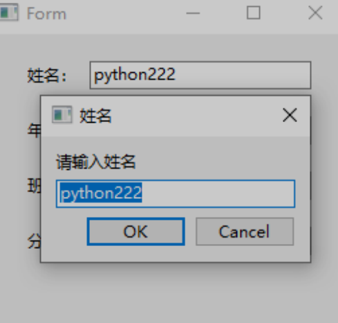
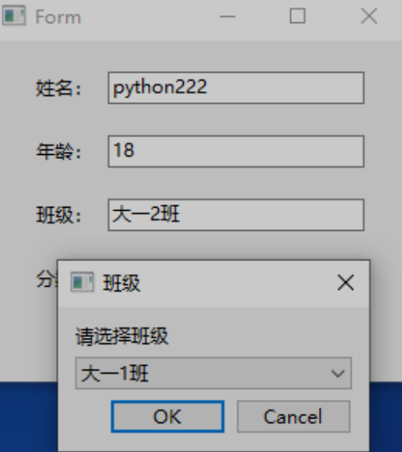
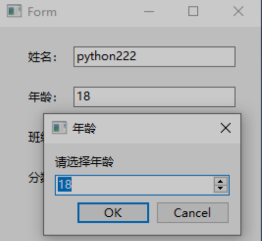
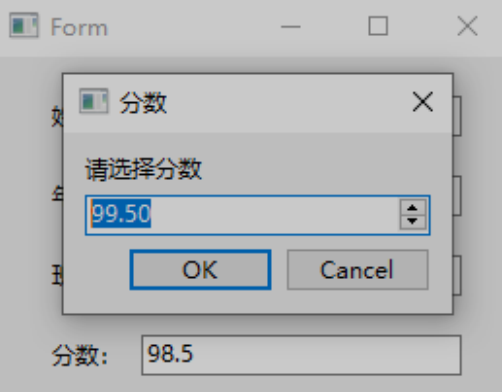
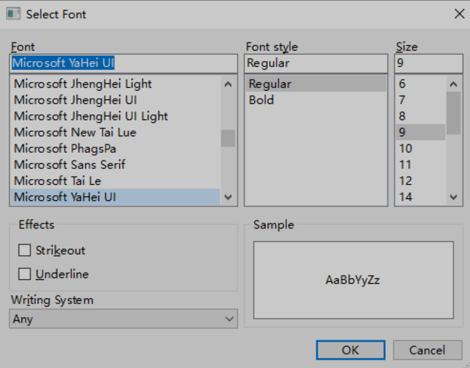
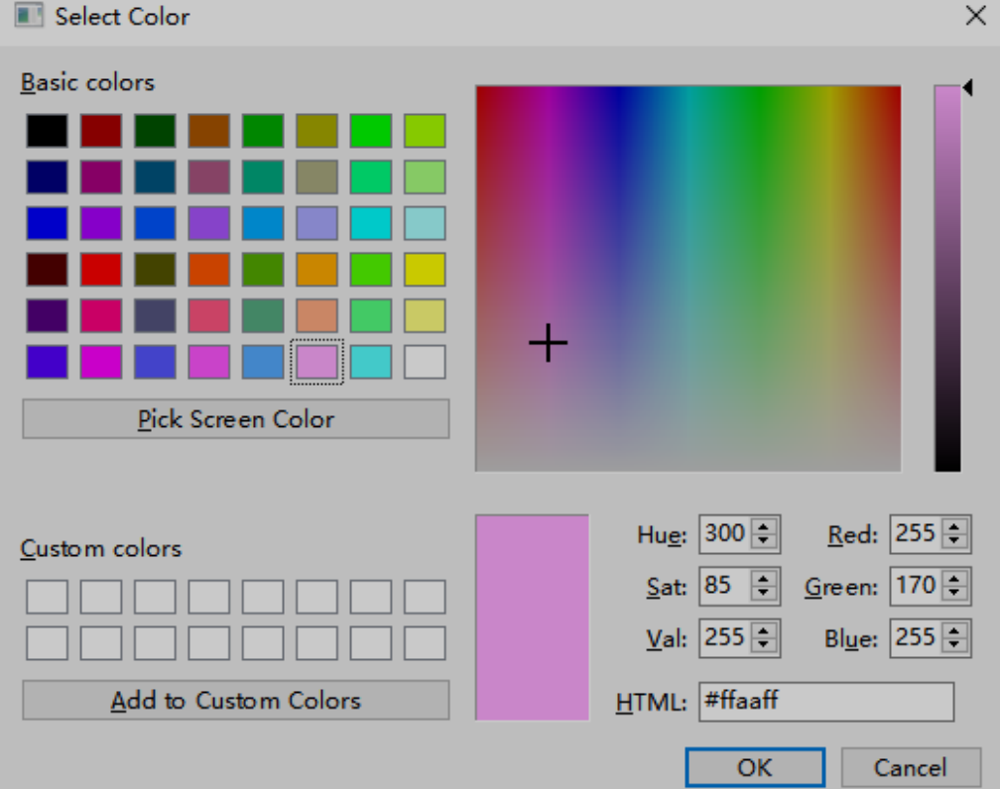

# QMessageBox对话框

对话框使用QMessageBox类表示，PyQt6内置5种不同类型的对话框，分别是消息对话框、问答对话框、警告对话框、错误对话框和关于对话框，它们的主要区别在于，弹出的对话框中的图标不同。

| **说明**                  | **对话框类型** |
| ------------------------- | -------------- |
| QMessageBox.information() | 消息对话框     |
| OMessageBox.critical()    | 错误对话框     |
| QMessageBox.question()    | 问答对话框     |
| QMessageBox.about()       | 关于对话框     |
| QMessageBox.warning()     | 警告对话框     |



## 对话框的常用按钮类型

| **按钮类型**                      | **说明** |
| --------------------------------- | -------- |
| QMessageBox.StandardButton.Ok     | 同意操作 |
| QMessageBox.StandardButton.Apply  | 应用操作 |
| QMessageBox.StandardButton.Ignore | 忽略操作 |
| QMessageBox.StandardButton.Yes    | 同意操作 |
| QMessagcBox.StandardButton.Close  | 关闭操作 |
| QMessageBox.StandardButton.No     | 取消操作 |
| OMessageBox.StandardButton.Cancel | 取消操作 |
| OMessageBox.StandardButton.Abort  | 终止操作 |
| OMessageBox.StandardButton.Open   | 打开操作 |
| QMessageBox.StandardButton.Retry  | 重试操作 |
| OMessageBox.StandardButton.Save   | 保存操作 |

多个按钮用 '|' 分隔

```python
QMessageBox.information(None, '消息对话框标题', '消息对话框内容',QMessageBox.StandardButton.Ok |QMessageBox.StandardButton.No)
```

# QFileDialog文件对话框控件

PyQt6中的文件对话框使用QFileDialog类表示，该类继承自QDialog类，它允许用户选择文件或者文件夹，也允许用户遍历文件系统，以便选择一个或多个文件或者文件夹。

## QFileDialog类的常用方法

| **方法**               | **说明**                                                     |
| ---------------------- | ------------------------------------------------------------ |
| getOpenFileName()      | 获取一个打开文件的文件名                                     |
| getOpenFileNames()     | 获取多个打开文件的文件名                                     |
| getSaveFileName()      | 获取保存的文件名                                             |
| getExistingDirectory() | 获取一个打开的文件夹                                         |
| setAcceptMode()        | 设置接收模式，取值如下。<br/>QFileDialog.AcceptOpen:设置文件对话框为打开模式，这是默认值;<br/>OFileDialog.AcceptSave:设置文件对话框为保存模式 |
| setDefaultSuffix()     | 设置文件对话框中的文件名的默认后缀名                         |
| setFileMode()          | 设置可以选择的文件类型，取值如下。<br/>QFileDialog.FileMode.AnyFile:任意文件(无论文件是否存在）﹔<br/>QFileDialog.FileMode.ExistingFile:已存在的文件;<br/>QFileDialog.FileMode.ExistingFiles:已存在的多个文件;<br/>QFileDialog.FileMode.Directory:文件夹;<br/>QFileDialog.FileMode.DirectoryOnly:文件夹（选择时只能选中文件夹) |
| setDirectory()         | 设置文件对话框的默认打开位置                                 |
| setNameFilter()        | 设置名称过滤器，多个类型的过滤器之间用两个分号分割（例如:所有文件(.);Python文件(.py))﹔而一个过滤器中如果有多种格式，可以用空格分割(例如:图片文件(.jpg .png.bmp)) |
| setViewMode()          | 设置显示模式，取值如下。<br/>QFileDialog.Detail:显示文件详细信息，包括文件名、大小、日期等信息;<br/>QFileDialog.List:以列表形式显示文件名 |
| selectedFile()         | 获取选择的一个文件或文件夹名字                               |
| selectedFiles()        | 获取选择的多个文件或文件夹名字                               |

# QInputDialog输入对话框控件

QInputDialog类表示一个标准的输入对话框，该对话框由一个文本框（或者数字选择框，或者下拉列表框）和两个按钮（OK按钮和Cancel按钮）组成，它可以与用户进行简单的交互，例如，在主窗口中获取输入对话框中输入或者选择的值。

QInputDialog类的常用方法：

## getText()方法的参数及返回值

getText()方法，显示一个用于输入字符串的文本编辑框。

| **参数**     | **说明**                                                     |
| ------------ | ------------------------------------------------------------ |
| QWidget      | 父窗口对象                                                   |
| dglTitle     | QInputDialog的标题                                           |
| txtLabel     | QInputDialog内部显示的文本                                   |
| echoMode     | 文本编辑框内容的显示方式                                     |
| defaultlnput | 文本编辑框默认显示内容                                       |
| 返回值       | 一个元组，其中text表示文本编辑框内的字符串，flag表示是否正常返回 |



## getItem()方法的参数及返回值

getItem()方法，显示一个ComboBox下拉列表控件，用户可从中选择数据z

| **参数** | **说明**                                                     |
| -------- | ------------------------------------------------------------ |
| QWidget  | 父窗口对象                                                   |
| dglTitle | QInputDialog的标题                                           |
| txtLabel | QlnputDialog内部显示的文本                                   |
| items    | ComboBox组件的内容列表                                       |
| curIndex | 默认显示ComboBox 组件哪一个索引的内容                        |
| editable | ComboBox组件是否可被编辑                                     |
| 返回值   | 一个元组，其中 text 表示从ComboBox下拉列表中选择的内容，flag表示是否正常返回 |



## getInt()方法的参数及返回值

getInt()方法。显示一个用于输入整数的编辑框，显示的是SpinBox控件。

| **参数**     | **说明**                                                     |
| ------------ | ------------------------------------------------------------ |
| QWidget      | 父窗口对象                                                   |
| dglTitle     | QInputDialog的标题                                           |
| txtLabel     | QInputDialog内部显示的文本                                   |
| defaultValue | SpinBox控件默认值                                            |
| minValue     | SpinBox控件最小值                                            |
| maxValue     | SpinBox控件最大值                                            |
| stepValue    | SpinBox控件单步值                                            |
| 返回值       | 一个元组，其中 inputValue表示SpinBox中选择的整数值，flag表示是否正常返回 |



## getDouble()方法的参数及返回值

getDouble()方法。显示一个用于输入浮点数的编辑框，显示的是DoubleSpinBox控件。

| **参数**     | **说明**                                                     |
| ------------ | ------------------------------------------------------------ |
| QWidget      | 父窗口对象                                                   |
| dglTitle     | QInputDialog的标题                                           |
| txtLabel     | QInputDialog内部显示的文本                                   |
| defaultValue | DoubleSpinBox控件默认值                                      |
| minValue     | DoubleSpinBox控件最小值                                      |
| maxValue     | DoubleSpinBox控件最大值                                      |
| decimals     | DoubleSpinBox控件显示的小数点位数控制                        |
| 返回值       | 一个元组，其中 inputValue表示DoubleSpinBox中选择的小数值，flag 表示是否正常返回 |



# QFontDialog字体对话框控件

QFontDialog类表示字体对话框，用户可以从中选择字体的大小、样式、格式等信息，类似Word中的字体对话框。

QFontDialog类最常用的方法是getFont()方法，用来获取在字体对话框中选择的字体相关的信息。

该方法的返回值包含一个QFont对象和一个标识，其中，QFont对象直接存储字体相关的信息，而标识用来确定是否正常返回，即是否单击了字体对话框中的OK按钮。



# QColorDialog颜色对话框控件

QColorDialog类表示颜色对话框，用户可以从中选择颜色。QColorDialog类最常用的方法是getColor()方法，用来获取在颜色对话框中选择的颜色信息。

