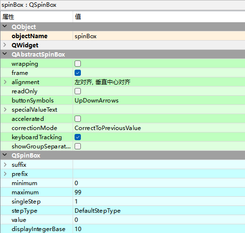
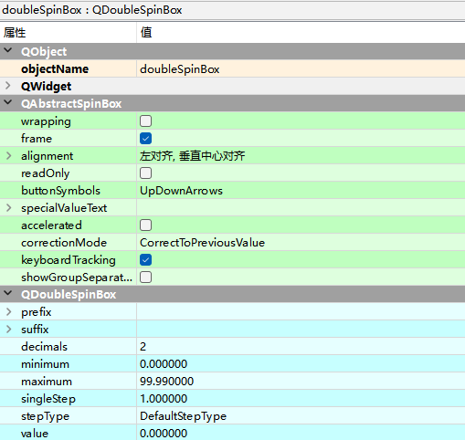

# QSpinBox整数数字选择

QSpinBox是一个整数数字选择控件，该控件提供一对上下箭头，用户可以单击上下箭头选择数值，也可

以直接输入。如果输入的数值大于设置的最大值，或者小于设置的最小值，SpinBox将不会接受输入。

Input Widgets —> Spin Box

| **方法**        | **描述**                                                     |
| --------------- | ------------------------------------------------------------ |
| setValue()      | 设置控件的当前值                                             |
| setMaximum()    | 设置最大值                                                   |
| setMinimum()    | 设置最小值                                                   |
| setRange()      | 设置取值范围(包括最大值和最小值)                             |
| setSingleStet() | 单击上下箭头时的步长值                                       |
| value()         | 获取控件中的值                                               |
| setStepType()   | QAbstractSpinBox::DefaultStepType：固定步长，可以通过 setSingleStep() 函数设置。 QAbstractSpinBox::AdaptiveDecimalStepType：自适应步长，根据数字的大 小自动调整步长。 |
| setPrefix()     | 设置前缀                                                     |
| setSuffix()     | 设置后缀                                                     |

# QDoubleSpinBox小数数字选择

Input Widgets —> Double Spin Box

QDoubleSpinBox与QSpinBox控件类似，区别是，它用来选择小数数字，并且默认保留两位小数。

QDoubleSpinBox控件的使用方法与QSpinBox类似，但由于它处理的是小数数字，因此，该控件提供了一个setDecimals()方法，用来设置小数的位数。

