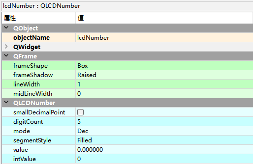

# QLCDNumber液晶数字显示

QLCDNumber控件主要用来显示液晶数字。

Display Widgets —> LCD Number

| **方法**               | **描述**                                                     |
| ---------------------- | ------------------------------------------------------------ |
| setDigitCount()        | 设置可以显示的数字数量                                       |
| setSmallDecimalPoint() | 是否有小数点，如果有小数点，就可以显示小数。                 |
| setMode()              | 设置显示数字的模式，有4种模式:Bin(二进制)、Oct(八进制)、Dec(十 进制)、Hex（十六进制) |
| setSegmentStyle()      | 设置显示样式,有3种样式:OutLine、Filled和Flat                 |
| value()                | 获取显示的数值                                               |

