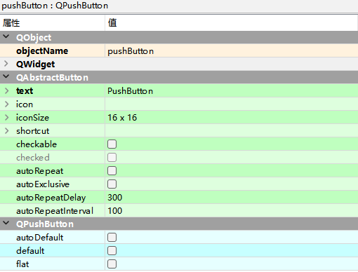
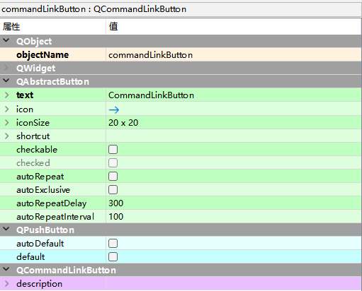

# QPushButton按钮控件

QPushButton是按钮控件，允许用户通过单击来执行操作。

QPushButton控件既可以显示文本，也可以显示图像，当该控件被单击时，它看起来像是被按下，然后

被释放。

## QAbstractButton 类属性

- `text` 显示文本

- `icon` 设置图标

- `iconSize` 图标大小

- `shortcut` 设置快捷键

- `checkable` 设置是否自动切换按钮

- `checked` 设置默认选中状态

- `autoRepeat` 设置是否会在用户按下时自动重复

- `autoExclusive` 设置是否启用自动排他性(设置这个可以变成多选)

- `autoRepeatDelay` 自动重复的初始延迟(以毫秒为单位)

- `autoRepeatInterval` 自动重复的时间间隔(以毫秒为单位)

`QCheckBox`,`QCheckBox`,`QCheckBox`,`QCheckBox` 这四个子类都拥有QAbstractButton的上述属性功能

## QPushButton 类属性

Buttons -> Push Button

- `autoDefault` 将按钮设置为对话框中的默认按钮

- `default` 设置按钮的默认状态

- `flat` 扁平化

# QCommandLinkButton命令链接按钮

CommandLinkButton对应类为QCommandLinkButton，实际上是从pushButton继承过来的一种按钮， 外观像是一个被设置了扁平化的 QPushButton，与PushButton不同主要有如下：

- 可以在按钮上显示双行文本，首行是QAbstractButton的text显示，次行类似于副标题，是通过CommandLinkButton的description属性来设置的；

- 默认情况下，它还会带有一个向右的箭头图标，该图标实际上就是QAbstractButton的ICon设置图标，只是填了一个右箭头作为缺省值；

- 默认类似于一个扁平化自动凸起的按钮。

