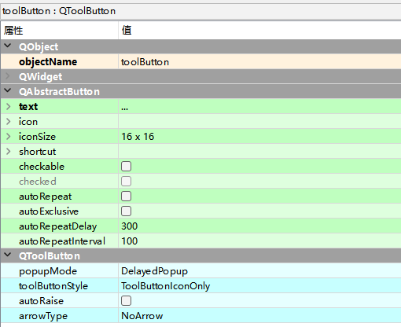

# QToolButton工具按钮

QToolButton控件是一个工具按钮，它本质上是一个按钮，只是在按钮中提供了默认文本“…”和可选的箭头类型；

QToolButton控件的使用方法与QPushButton类似，不同的是，QToolButton控件可以设置工具按钮的显示样式和箭头类型，其中，工具按钮的显示样式通过QToolButton类的setToolButtonStyle()方法进行设置；

工具按钮的箭头类型通过QToolButton类的setArrowType()方法进行设置；

Buttons -> Tool Button

## 工具按钮

`setText()`:设置按钮提示文本

`setIcon(QIcon())`:设置按钮图标

`setIconSize(QSize)`:设置图标大小

`setToolTip(str)`:因为图标和提示文本同时出现时，只显示图标。通过这个可以设置不一样的提示文本

## 样式设置

`setToolButtonStyle(Qt.ToolButtonStyle)`

Qt.ToolButtonStyle的风格有以下取值：

- `Qt.ToolButtonIconOnly`仅显示图标

- `Qt.ToolButtonTextOnly`仅显示文字

- `Qt.ToolButtonTextBesideIcon`文本显示在图标旁边

- `Qt.ToolButtonTextUnderIcon`文本显示在图标下方

- `Qt.ToolButtonFollowStyle`遵循风格

## 箭头样式

`setArrowType(Qt.ArrowType)`

Qt.ArrowType的风格如下：

`Qt.NoArrow:`无箭头

`Qt.UpArrow`向上箭头

`Qt.DownArrow`向下箭头

`Qt.LeftArrow`向左箭头

`Qt.RightArrow`向右箭头

## 自动提升

`setAutoRaise(Bool)：True`自动提升

## 菜单及弹出方式

`setPopupMode(QToolButton.ToolButtonPopupMode)`

QToolButton.ToolButtonPopupMode的风格如下：

`QToolButton.DelayedPopup`鼠标按住一会才显示菜单

`QToolButton.MenuButtonPopup`有一个专门提示的提示箭头

`QToolButton.InstantPopup`点了按钮就显示菜单

