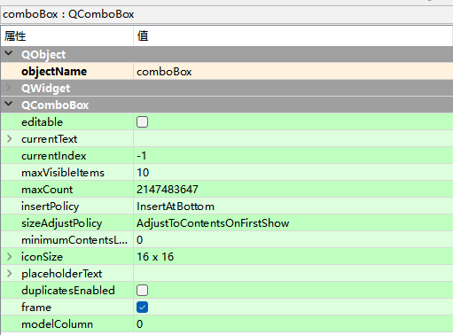

# QComboBox下拉组合框

QComboBox控件，又称为下拉组合框控件，它主要用于在下拉组合框中显示数据，用户可以从中选择项。

Input Widgets -> Combo Box

## `【read-only】count : const int`

组合框中的项目数。

## `【read-only】currentData : const QVariant`

当前项目的数据。

## `currentIndex : int`

组合框中当前项目的索引。插入或删除项目时，当前索引可以更改。

## `currentText : QString`

当前文本。如果组合框是可编辑的，则当前文本是行编辑显示的值。

如果组合框是可编辑的，setCurrentText() 只会调用 setEditText()。否则，如果列表中有匹配的文本，则 currentIndex 设置为相应的索引。

## `duplicatesEnabled : bool`

可编辑时设置setSizeAdjustPolicy()将输入内容插入到组合框，是否可以在组合框中插入重复项。默认为false。

请注意，始终可以以编程方式将重复项插入组合框。

## `editable : bool`

是否可以编辑组合框。默认为 false。编辑的效果取决于插入策略。

注意：禁用可编辑状态时，将删除验证器和完成器。

## `iconSize : QSize`

组合框中显示的图标的大小。这是图标可以具有的最大大小，较小尺寸的图标不会放大。

## `insertPolicy : InsertPolicy`

可编辑时插入的项目应出现在组合框中的位置的策略。

默认值为 InsertAtBottom，即新项目将出现在项目列表的底部。

## `maxCount : int`

组合框中允许的最大项目数。

如果将最大数量设置为小于组合框中当前项目的数量，则额外的项目将被截断。如果在组合框上设置了外部模型，这也适用。

## `maxVisibleItems : int`

组合框屏幕上允许的最大项目数。默认为 10。

对于 QStyle::SH_ComboBox_Popup 返回 true 的样式中的不可编辑组合框，将忽略此属性。

## `minimumContentsLength : int`

应适合组合框的最小字符数。默认值为 0。

如果此属性设置为正值，则 minimumSizeHint() 和 sizeHint() 会将其考虑此属性在内。

## `modelColumn : int`

模型中可见的列。默认为 0。

## `placeholderText : QString`

未设置有效索引时显示的占位符文本文本。

当设置无效索引时将显示占位符文本，下拉列表中的文本不可访问。在添加项目之前调用此函数时，将显示占位符文本，否则如果要显示占位符文本，则必须以编程方式调用 setCurrentIndex(-1)。

当 QComboBox 可编辑时，请改用 lineEdit()->setPlaceholderText()。

## `sizeAdjustPolicy : SizeAdjustPolicy`

内容更改时组合框大小如何更改的策略。默认值为 AdjustToContentsOnFirstShow。

## `enum QComboBox::InsertPolicy：`

此枚举指定当用户输入新字符串时 QComboBox 应该做什么。

`NoInsert：`字符串不会插入组合框。

`InsertAtTop：`字符串将作为组合框中的第一项插入。

`InsertAtCurrent：`当前项目将被字符串替换。

`InsertAtBottom：`字符串将插入组合框中的最后一项之后。

`InsertAfterCurrent：`在组合框中的当前项目之后插入字符串。

`InsertBeforeCurrent：`在组合框中的当前项目之前插入字符串。

`InsertAlphabetically：`字符串按字母顺序插入组合框中。

## enum QComboBox::SizeAdjustPolicy：

此枚举指定当添加新内容或内容更改时 QComboBox 的大小提示应如何调整

`AdjustToContents：`组合框将始终根据内容进行调整

`AdjustToContentsOnFirstShow：`组合框将在第一次显示时调整其内容。

`AdjustToMinimumContentsLengthWithIcon：`组合框将调整为 minimumContentsLength 加上图标的空间。 出于性能原因，应在大型模型上使用此策略。

# QComboBox类的常用方法

| **方法**                | **说明**             |
| ----------------------- | -------------------- |
| addItem()               | 添加一个下拉列表项   |
| addItems()          | 从列表中添加下拉选项 |
| currentText()           | 获取选中项的文本 |
| currentIndex()          | 获取选中项的索引 |
| itemText(index)         | 获取索引为index的项的文本 |
| setItemText(index,text) | 设置索引为index的项的文本 |
| count()                 | 获取所有选项的数量 |
| clear()                 | 删除所有选项 |

