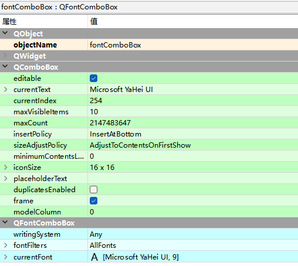

# QFontComboBox字体组合框控

`QFontComboBox`控件又称为字体组合框控件，它主要用于在下拉组合框中显示并选择字体。

`QFontComboBox`继承自`QComboBox`，自己拥有三个属性，分别是`writingSystem`，`fontFilters`，`currentFont`

Input Widgets -> Font Combo Box

## writingSystem

`writingSystem`是书写系统，书写系统包括一个或多个文字集和一系列规则，一个书写系统至少对应一种语言，可以用书写系统的符号集合和规则比如拼写规则、大小写等来表达对应的语言，如汉字、日文、罗马字等。

## fontFilters

`fontFilters`是字体过滤器，以`QFontComboBox`类中提供了一个`setFontFilters()`方法，用来设置可以选择的字体，该方法的参数值及说明如下：

- `QFontComboBox.AllFonts：`所有字体

- `QFontComboBox.ScalableFonts：`可以自动伸缩的字体

- `QFontComboBox.NonScalableFonts：`不自动伸缩的字体

- `QFontComboBox.MonospacedFonts：`等宽字体

- `QFontComboBox.ProportionalFonts：`比例字体

## currentFont

currentFont当前字体

