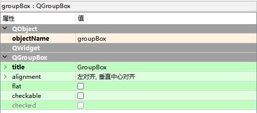

# QGroupBox分组框

GroupBox控件又称为分组框控件，主要为其他控件提供分组，并且按照控件的分组来细分窗口的功能。

Containers -> Group Box

## QGroupBox类的常用方法

| **方法**       | **说明**                                                     |
| -------------- | ------------------------------------------------------------ |
| setAlignment() | 设置对齐方式，包括水平对齐和垂直对齐两种水平对齐方式包括如下4种。 Qt.AlignLeft:左对齐; Qt.AlignHCenter:水平居中对齐; Qt.AlignRight:右对齐; Qt.AlignJustify:两端对齐;  垂直对齐方式包括如下3种。 Qt.AlignTop:顶部对齐; Qt.AlignVCenter:垂直居中; Qt.AlignBottom:底部对齐; |
| setTitle()     | 设置分组标题                                                 |
| setFlat()      | 设置是否以扁平样式显示                                       |

