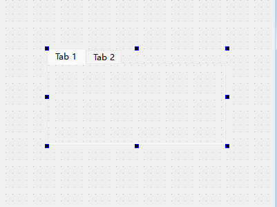
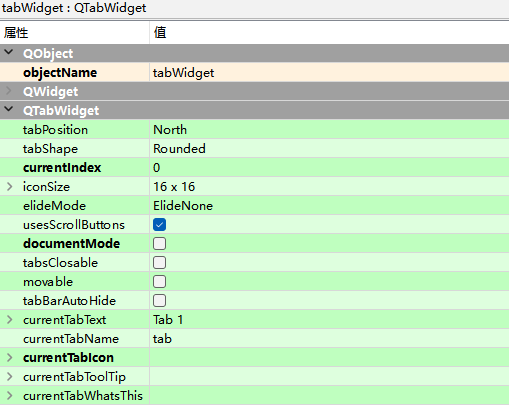

# QTabWidget选项卡

TabWidget控件又称选项卡控件，它主要为其他控件提供分组，并且按照控件的分组来细分窗口的功能。

Containers -> Tab Widget

## QTabWidget类的常用方法

| **方法**           | **说明**                   |
| ------------------ | -------------------------- |
| addTab()           | 添加选项卡                 |
| inserTab()         | 插入选项卡                 |
| removeTab()        | 删除选项卡                 |
| currentWidget()    | 获取当前选项卡             |
| currentIndex()     | 获取当前选项卡的索引       |
| setCurrentIndex()  | 设置当前选项卡的索引       |
| setCurrentWidget() | 设置当前选项卡             |
| setTabPosition()   | 设置选项卡的标题位置       |
| setTabsClosable()  | 设置是否可以独立关闭选项卡 |
| setTabText()       | 设置选项卡标题文本         |
| tabText()          | 获取指定选项卡的标题文本   |

