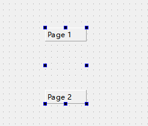
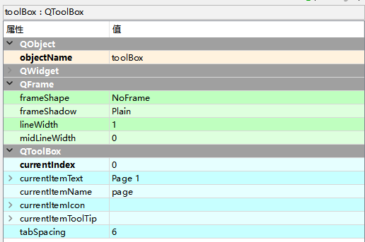

# QToolBox工具盒

QToolBox控件又称为工具盒控件，它主要提供一种列状的层叠选项卡。

Containers -> Tool Box

## QToolBox类的常用方法

| **方法**          | **说明**                 |
| ----------------- | ------------------------ |
| addItem()         | 添加选项卡               |
| setCurrentIndex() | 设置当前选中的选项卡索引 |
| setItemlcon()     | 设置选项卡的图标         |
| setItemText()     | 设置选项卡的标题文本     |
| setItemEnabled()  | 设置选项卡是否可用       |
| inserItem()       | 插入新选项卡             |
| removeItem()      | 移除选项卡               |
| itemText()        | 获取选项卡的文本         |
| currentIndex()    | 获取当前选项卡的索引     |

