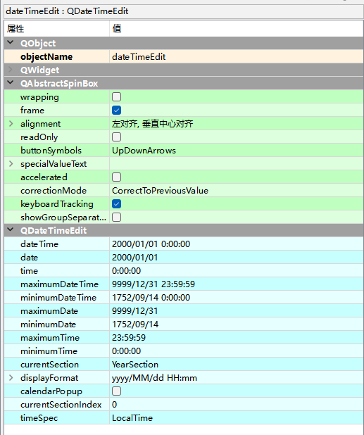
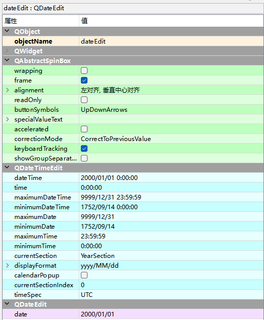
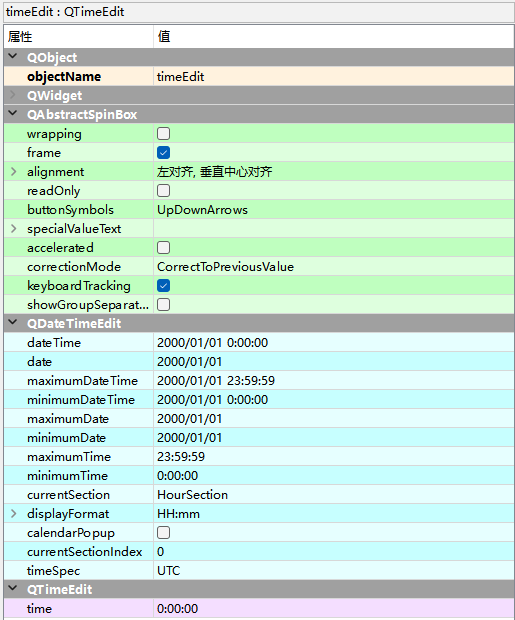

# QDateTimeEdit日期时间

QDateTimeEdit日期时间控件同时显示日期和时间，可以对日期时间进行编辑，选择以及显示。

Input Widgets —> Date/Time Edit

## QDateTimeEdit类的常用方法

| **方法**            | **说明**                                                     |
| ------------------- | ------------------------------------------------------------ |
| setTime()           | 设置时间，默认为0:00:00                                      |
| setCalendarPopup()  | 弹出日历设置，默认False                                      |
| setMaximumTime()    | 设置最大时间，默认为23:59:59                                 |
| setMinimumTime()    | 设置最小时间，默认为0:00:00                                  |
| setTimeSpec()       | 获取显示的时间标准，支持以下4种值。 LocalTime:本地时间; UTC:世界标准时间; OffsetFromUTC:与UTC等效的时间; TimeZone:时区 |
| setDateTime()       | 设置日期时间，默认为2000/1/1 0:00:00                         |
| setDate()           | 设置日期，默认为2000/1/1                                     |
| setMaximumDate()    | 设置最大日期，默认为9999/12/31                               |
| setMinimumDate()    | 设置最小日期，默认为1752/9/14                                |
| setDisplayFormat(） | 设置日期、时间的显示样式。 日期样式(yyyy表示4位数年份，MM表示2位数月份，dd表示2位数日）: yyyy/MM/dd、yyyy/M/d、yy/MM/dd、yy/M/d、yy/MM 和 Mm/dd 时间样式(HH表示2位数小时，mm表示2位数分钟，ss表示2位数秒钟）: HH:mm:ss、HH:mm、mm:ss、H:m和 m:s |
| date()              | 获取显示的日期，返回值为QDate类型，如 QDate(2000,1,1)        |
| time()              | 获取显示的时间，返回值为QTime类型，如QTime(0,0)              |
| dateTime()          | 获取显示的日期时间，返回值为QDateTime类型，如：QDateTime(2000,1,1,0,0) |

# QDateEdit日期

QDateEdit是单纯的日期控件，继承QDateTimeEdit，拥有QDateTimeEdit的所有属性和方法。

Input Widgets —> Date Edit

# QTimeEdit时间

QTimeEdit是单纯的时间控件，继承QDateTimeEdit，拥有QDateTimeEdit的所有属性和方法。

Input Widgets —> Time Edit

