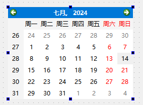
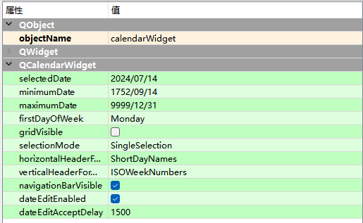

# QCalendarWidget日历

CalendarWidget控件又称为日历控件，主要用来显示和选择日期。

Display Widgets —> Calendar Edit

## QCalendarWidget类的常用方法

| **方法**                    | **说明**                                                     |
| --------------------------- | ------------------------------------------------------------ |
| setSelectedDate()           | 设置选中的日期，默认为当前日期                               |
| setMinimumDate()            | 设置最小日期，默认为1752/9/14                                |
| setMaximumDate()            | 设置最大日期，默认为9999/12/31                               |
| setFirstDayOfWeek()         | 设置一周的第一天，取值如下。 Qt.Monday:星期一; Qt.Tuesday:星期二; Qt.Wednesday:星期三; Qt.Thursday:星期四; Qt.Friday:星期五; Qt.Saturday:星期六; Qt.Sunday:星期日 |
| setGridVisible()            | 设置是否显示网格线                                           |
| setSelectionMode()          | 设置选择模式，取值如下。 QCalendarWidget.NoSelection:不能选中日期 QCalendarWidget.SingleSelection:可以选中一个日期 |
| setHorizontalHeaderFormat() | QCalendarWidget.LongDayNames:完整天的名称，如“星期一”        |
| setVerticalHeaderFormat()   | 设置对齐方式，有水平和垂直两种，分别如下。 QCalendarWidget.NoVerticalHeader:不显示垂直头部; QCalendarWidget.IsOWeekNumbers:以星期数字显示垂直头部 |
| setNavigationBarVisible()   | 设置是否显示导航栏                                           |
| setDateEditEnabled()        | 设置是否可以编辑日期                                         |
| setDateEditAcceptDelay()    | 设置编辑日期的最长间隔，默认为1500                           |
| selectedDate()              | 获取选择的日期，返回值为QDate类型                            |

