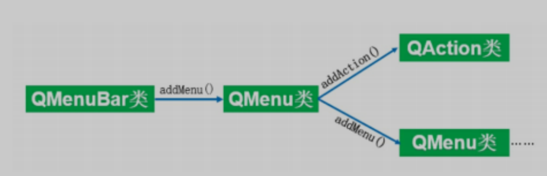

# QMenuBar菜单栏

在PyQt6中，菜单栏使用QMenuBar类表示，它分为两部分：主菜单和菜单项，其中，主菜单被显示为一个QMenu类，而菜单项则使

用QAciton类表示。一个QMenu中可以包含任意多个QAction对象，也可以包含另外的QMenu，用来表示级联菜单。

QMenuBar类是所有窗口的菜单栏。

## QMenuBar类的常用方法

| **方法**       | **说明**       |
| -------------- | -------------- |
| addAction()    | 添加菜单项     |
| addMenu()      | 添加菜单       |
| addActions()   | 添加多个菜单项 |
| addSeparator() | 添加分割线     |

## QMenu类的常用方法

QMenu类表示菜单栏中的菜单，可以显示文本和图标，但是并不负责执行操作，类似Label的作用。

| **方法**       | **说明**           |
| -------------- | ------------------ |
| addAction()    | 添加菜单项         |
| setTitle()     | 设置菜单的文本     |
| addMenu()      | 添加菜单           |
| title()        | 获取菜单的标题文本 |
| addSeparator() | 添加分割线         |

## QAction类的常用方法

QAction类是菜单项。PyQt6将用户与界面进行交互的元素抽象为一种“动作” ，使用QAction类表示。

QAction才是真正负责执行操作的部件。

| **方法**               | **说明**           |
| ---------------------- | ------------------ |
| setIcon()              | 设置菜单项图标     |
| setShortcut()          | 设置快捷键         |
| setIconVisibleInMenu() | 设置图标是否显示   |
| setToolTip()           | 设置提示文本       |
| setText()              | 添加菜单项文本     |
| setEnabled()           | 设置菜单项是否可用 |
| setIconText()          | 设置图标文本       |
| text()                 | 获取菜单项的文本   |

