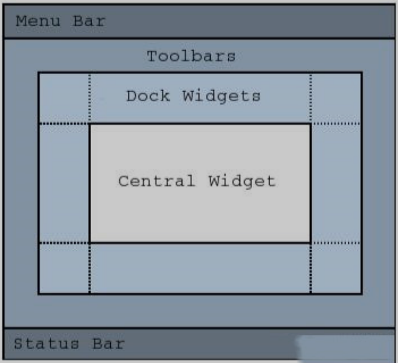
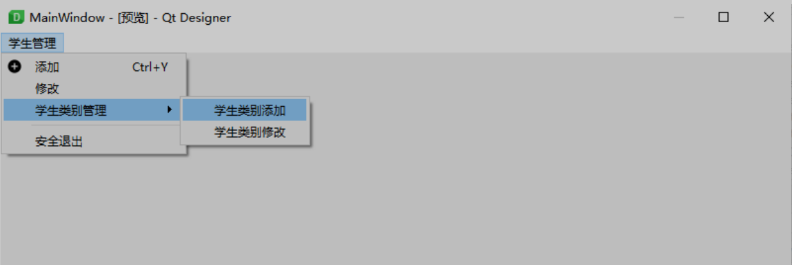
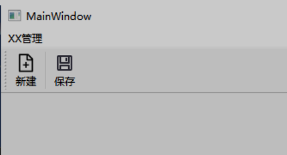
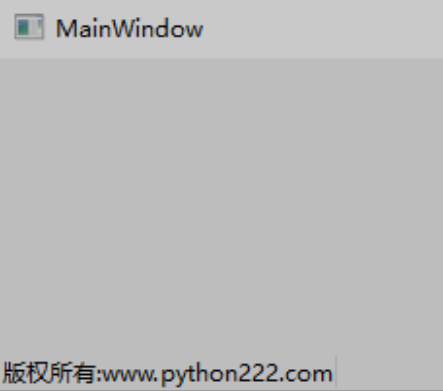
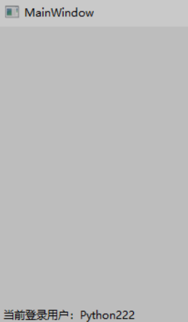

#  QMainWindow主窗体

主窗体类是通用的主窗体，包含菜单栏（QMenuBar），工具栏（QToolBar），悬停部件（QDockWidget）、中央部件（Central Widget）、状态栏（QStatusBar）等基本类型

# QToolBar工具栏控件

QToolBar类表示工具栏，它是一个由文本按钮、图标或者其他小控件组成的可移动面板，通常位于菜单栏下方。

## QToolBar类的常用方法

| **方法**              | **说明**                                                     |
| --------------------- | ------------------------------------------------------------ |
| addAction()           | 添加具有文本或图标的工具按钮                                 |
| addActions()          | 一次添加多个工具按钮                                         |
| addWidget()           | 添加工具栏中按钮以外的控件                                   |
| addSeparator()        | 添加分割线                                                   |
| setIconSize()         | 设置工具栏中图标的大小                                       |
| setMovable()          | 设置工具栏是否可以移动                                       |
| setOrientation()      | 设置工具栏的方向，取值如下。 Qt.Horizontal:水平工具栏; Qt.Vertical:垂直工具栏 |
| setToolButtonStyle()) | 设置工具栏按钮的显示样式，主要支持以下5种样式。 Qt.ToolButtonIconOnly:只显示图标; Qt.ToolButtonTextOnly:只显示文本; Qt.ToolButtonTextBesidelcon:文本显示在图标的旁边; Qt.ToolButtonTextUnderIcon:文本显示在图标的下面; Qt.ToolButtonFollowStyle:跟随系统样式 |

# QStatusBar状态栏

状态栏通常放在窗口的最底部，用于显示窗口上的一些对象的相关信息或者程序信息，例如，显示当前登录用户、实时显示登录时间、显示任务执行进度等，在PyQt6中用QStatusBar类表示状态栏。

## QStatusBar类的常用方法

| **方法**             | **说明**                                            |
| -------------------- | --------------------------------------------------- |
| addWidget()          | 向状态栏中添加控件                                  |
| addPermanentWidget() | 添加永久性控件,不会被临时消息掩盖，位于状态栏最右端 |
| removeWidget()       | 移除状态栏中的控件                                  |
| showMessage()        | 在状态栏中显示一条临时信息                          |
| clearMessage()       | 删除正在显示的临时信息                              |

PyQt6支持向状态栏中添加标准控件，如常用的Label、ComboBox、CheckBox、ProgressBar等，这需要用到QStatusBar对象的addWidget()方法。

在状态栏中显示临时信息，需要使用QStatusBar对象的showMessage()方法，该方法中有两个参数，第一个参数为要显示的临时信息内容，第二个参数为要显示的时间，以毫秒为单位，但如果设置该参数为0，则表示一直显示。删除临时信息使用QStatusBar对象的clearMessage()方法。

注意点：状态栏默认不能同时显示临时信息和PyQ6标准控件，所以只能用一种。

