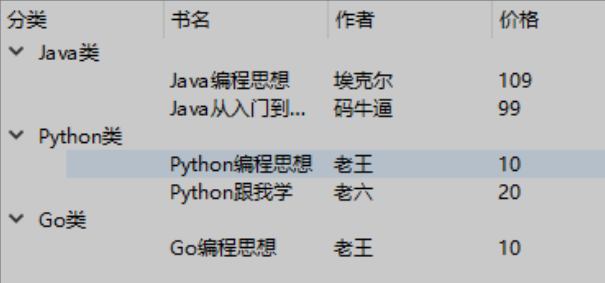

# QTreeView树视图

树控件可以为用户显示节点层次结构，而每个节点又可以包含子节点，包含子节点的节点叫父节点，在设计树形结构（如导航菜单等）时，非常方便。

QTreeView是一个可以显示树形数据结构的小部件。QTreeWidget是QTreeView的封装，它在QTreeView的基础上添加了一些额外的功能，如添加、删除和编辑项目等。因此，QTreeWidget更为易用，而QTreeView更灵活。

QTreeView类，它是树控件的基类，使用时，必须为其提供一个模型来与之配合。

## QTreeView类的常用方法

| **方法**                       | **说明**                                                     |
| ------------------------------ | ------------------------------------------------------------ |
| autoExpandDelay()              | 获取自动展开节点所需的延时时间                               |
| collapse()                     | 收缩指定级的节点                                             |
| collapseAll()                  | 收缩所有节点                                                 |
| expand()                       | 展开指定级的节点                                             |
| expandAll()                    | 展开所有节点                                                 |
| header()                       | 树的头信息，常用的有一个setVisible(方法，用来设置是否显示头  |
| isHeaderHidder()               | 判断是否隐藏头部                                             |
| setAutoExpandDelay()           | 设置自动展开的延时时间，单位为毫秒，如果值小于0，表示禁用自动展开 |
| setAlternatingRowColors()      | 设置每间隔一行颜色是否一样                                   |
| setExpanded()                  | 根据索引设置是否展开节点                                     |
| setHeaderHidden()              | 设置是否隐藏头部                                             |
| setItemsExpandable()           | 设置项是否展开                                               |
| setModel()                     | 设置要显示的数据模型                                         |
| setSortingEnabled()            | 设置单击头部时是否可以排序                                   |
| setVerticalScrollBarPolicy()   | 设置是否显示垂直滚动条                                       |
| setHorizontalScrollBarPolicy() | 设置是否显示水平滚动条                                       |
| setEditTriggers()              | 设置默认的编辑触发器                                         |
| setExpandsOnDoubleClick()      | 设置是否支持双击展开树节点                                   |
| setWordWrap()                  | 设置自动换行                                                 |
| sclectionModel()               | 获取选中的模型                                               |
| sortByColumn()                 | 根据列排序                                                   |
| setSelectionMode()             | 设置选中模式，取值如下。 QAbstractItemView.NoSelection:不能选择; QAbstractItemView.SingleSelection:单选; QAbstractItemView.MultiSelection:多选; QAbstractItemView.ExtendedSelection:正常单选，按Ctrl或者Shift键后，可以多选; QAbstractItemView.ContiguousSelection:与 ExtendedSelection类似 |
| setSelectionBehavior()         | 设置选中方式，取值如下。 QAbstractItemView.SelectItems:选中当前项; QAbstractItemView.SelectRows:选中整行; QAbstractItemView.SelectColumns:选中整列 |

`QTreeView` **类属性**

- `autoExpandDelay` 拖放操作期间打开树中项目之前的延迟时间

- `indentation` 树视图中项目的缩进

- `rootIsDecorated` 是否显示用于展开和折叠顶级项目的控件

- `uniformRowHeights` 所有项目是否具有相同的高度

- `itemsExpandable` 项目是否可由用户展开

- `animated` 是否启用动画

- `allColumnsShowFocus` 项目是否应使用所有列显示键盘焦点

- `wordWrap` 文本自动换行策略

- `headerHidden` 标头是否显示

- `expandsOnDoubleClick` 是否可以通过双击扩展项目

QTreeWidget **类属性**

- `columnCount` 显示的列数

Header **属性**

- `headerVisible` 是否显示标题

- `headerCascadingSectionResizes` 标题列宽联动调整大小

- `headerDefaultSectionSize` 默认标题列宽大小

- `headerHighlightSections` 所选项目的部分是否突出显示

- `headerMinimumSectionSize` 标题可调节的最小尺寸

- `headerShowSortIndicator` 标题显示排序指示器

- `headerStretchLastSection` 是否可调节最后一列的宽度

| **模型**                 | **说明**                                     |
| ------------------------ | -------------------------------------------- |
| QStringListModel         | 存储简单的字符串列表                         |
| QStandardItemModel       | 可以用于树结构的存储，提供了层次数据         |
| QFileSystemModel         | 存储本地系统的文件和目录信息（针对当前项目） |
| QSqlQueryModel           | 存储SQL的查询结构集                          |
| QSqlTableModel           | 存储SQL中的表格数据                          |
| QSqlRelationalTableModel | 存储有外键关系的SOL表格数据                  |
| QSortFilterProxyModel    | 对模型中的数据进行排序或者过滤               |

