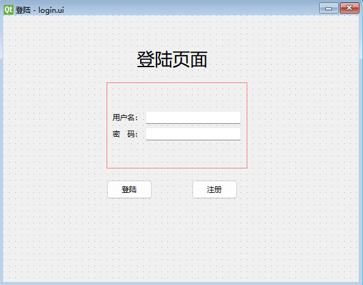
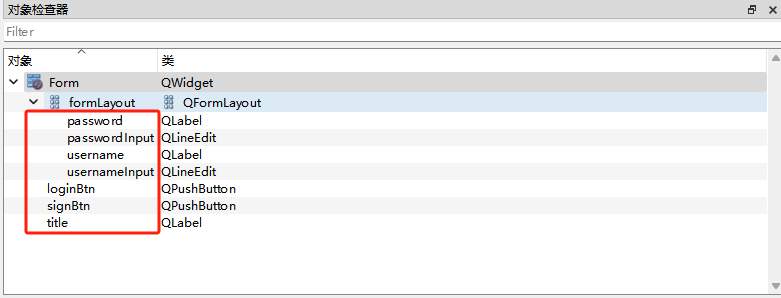

# 登陆

## 绘制画面



1. 打开`QtDesigner`，选择`Widget`即可，因为不需要状态栏之类的属性，修改窗口名`QWidget —> windowTitle`。

2. 使用表单布局`Form Layout`。

3. 标题`Label`，图标`QLabel -> pixmap`，图标缩放`QLabel -> scaledContents`

4. 用户名`Label`，用户名输入框`Line Edit`

5. 密码`Label`，密码输入框`Line Edit`，改为密文`QLineEdit -> echoMode : password`。

6. 按钮`Push Button`，加载图标`QA bstractButton -> icon`

7. 为了方便代码和画面相对应，需修改`对象检测器`中的`栏位属性名`



## 代码

### 1. 生成代码

使用`pyuic`将`ui文件`转为`py代码`

### 2. 生成init方法

`ctrl+O` 生成`__init__`方法

```python
    def __init__(self):
        super(Ui_Form, self).__init__()
        self.setupUi(self)
```
`class Ui_Form(object)`参数`object`替换成`QWidget`

```python
class Ui_Form(QWidget):

    def __init__(self):
        super(Ui_Form, self).__init__()
        self.setupUi(self)
```

### 3. 主方法

```python
if __name__ == '__main__':
    app = QApplication(sys.argv)
    ui = Ui_Form()
    ui.show()
    sys.exit(app.exec())
```

### 4. 按钮方法

实现功能，点击按钮，会清空表单数据

```python
    def resetForm(self):
        print("resetForm")
        self.usernameInput.setText("")
        self.passwordInput.setText("")
```

### 5. 绑定按钮

将写好的按钮方法和signBtn按钮进行绑定，点击按钮，就会执行按钮方法

```python
        #绑定按钮
        self.signBtn.clicked.connect(self.resetForm)
```

### 6. 完整代码

```python
import sys
import typing

from PySide6 import QtCore, QtGui, QtWidgets
from PySide6.QtWidgets import QApplication, QWidget, QMessageBox

from src.dao import userDao
from src.entity.userModel import User


class Ui_Form(QWidget):

    def __init__(self):
        super(Ui_Form, self).__init__()
        self.setupUi(self)

    def setupUi(self, Form):
        Form.setObjectName("Form")
        Form.resize(584, 437)
        self.formLayoutWidget = QtWidgets.QWidget(parent=Form)
        self.formLayoutWidget.setGeometry(QtCore.QRect(170, 110, 274, 151))
        self.formLayoutWidget.setObjectName("formLayoutWidget")
        self.formLayout = QtWidgets.QFormLayout(self.formLayoutWidget)
        self.formLayout.setLabelAlignment(QtCore.Qt.AlignmentFlag.AlignCenter)
        self.formLayout.setFormAlignment(QtCore.Qt.AlignmentFlag.AlignCenter)
        self.formLayout.setContentsMargins(10, 10, 10, 10)
        self.formLayout.setObjectName("formLayout")
        self.username = QtWidgets.QLabel(parent=self.formLayoutWidget)
        self.username.setObjectName("username")
        self.formLayout.setWidget(0, QtWidgets.QFormLayout.ItemRole.LabelRole, self.username)
        self.usernameInput = QtWidgets.QLineEdit(parent=self.formLayoutWidget)
        self.usernameInput.setObjectName("usernameInput")
        self.formLayout.setWidget(0, QtWidgets.QFormLayout.ItemRole.FieldRole, self.usernameInput)
        self.password = QtWidgets.QLabel(parent=self.formLayoutWidget)
        self.password.setObjectName("password")
        self.formLayout.setWidget(1, QtWidgets.QFormLayout.ItemRole.LabelRole, self.password)
        self.passwordInput = QtWidgets.QLineEdit(parent=self.formLayoutWidget)
        self.passwordInput.setEchoMode(QtWidgets.QLineEdit.EchoMode.Password)
        self.passwordInput.setObjectName("passwordInput")
        self.formLayout.setWidget(1, QtWidgets.QFormLayout.ItemRole.FieldRole, self.passwordInput)
        self.loginBtn = QtWidgets.QPushButton(parent=Form)
        self.loginBtn.setGeometry(QtCore.QRect(170, 270, 75, 31))
        icon = QtGui.QIcon()
        icon.addPixmap(QtGui.QPixmap("../../public/阴阳-太极02.png"), QtGui.QIcon.Mode.Normal, QtGui.QIcon.State.Off)
        self.loginBtn.setIcon(icon)
        self.loginBtn.setObjectName("loginBtn")
        self.signBtn = QtWidgets.QPushButton(parent=Form)
        self.signBtn.setGeometry(QtCore.QRect(310, 270, 75, 31))
        self.signBtn.setObjectName("signBtn")

        #绑定按钮
        self.signBtn.clicked.connect(self.resetForm)
        # self.loginBtn.clicked.connect(self.login)

        self.title = QtWidgets.QLabel(parent=Form)
        self.title.setGeometry(QtCore.QRect(270, 50, 141, 41))
        font = QtGui.QFont()
        font.setPointSize(22)
        self.title.setFont(font)
        self.title.setObjectName("title")
        self.label = QtWidgets.QLabel(parent=Form)
        self.label.setGeometry(QtCore.QRect(200, 50, 50, 50))
        self.label.setText("")
        self.label.setPixmap(QtGui.QPixmap("../../public/阴阳-太极02.png"))
        self.label.setScaledContents(True)
        self.label.setObjectName("label")

        self.retranslateUi(Form)
        QtCore.QMetaObject.connectSlotsByName(Form)

    def retranslateUi(self, Form):
        _translate = QtCore.QCoreApplication.translate
        Form.setWindowTitle(_translate("Form", "登陆"))
        self.username.setText(_translate("Form", "用户名："))
        self.password.setText(_translate("Form", "密   码："))
        self.loginBtn.setText(_translate("Form", "登陆"))
        self.signBtn.setText(_translate("Form", "注册"))
        self.title.setText(_translate("Form", "登陆页面"))

    def resetForm(self):
        print("resetForm")
        self.usernameInput.setText("")
        self.passwordInput.setText("")

    def login(self):
        """
        用户登陆判断，数据库判断成功，则打开主窗体，否则提示报错信息
        """
        userDao.createDB()
        compid = "hexagram"
        userName = self.usernameInput.text()
        password = self.passwordInput.text()
        if userName is None or password is None or userName.strip() == "" or password.strip() == "":
            QMessageBox.warning(None, "系统提示", "用户名或密码不能为空")
        else:
            user = User(compid, userName, password)
            resultUser = userDao.login(user)
            print(resultUser)
            if resultUser:
                QMessageBox.information(None, "系统提示", "登录成功")
            else:
                QMessageBox.warning(None, "系统提示", "用户名或密码输入错误")

if __name__ == '__main__':
    app = QApplication(sys.argv)
    ui = Ui_Form()
    ui.show()
    sys.exit(app.exec())
```