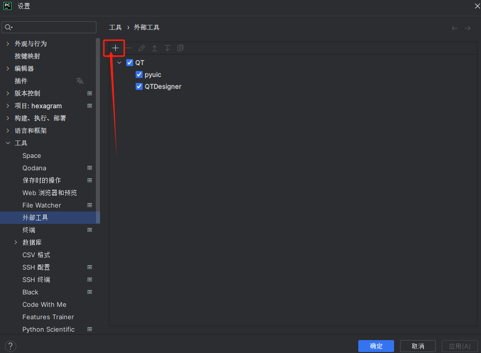
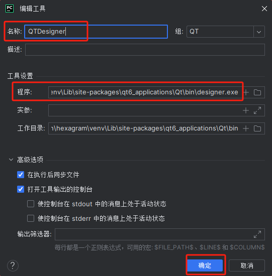
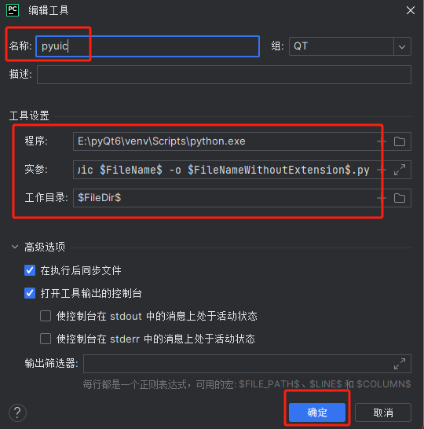
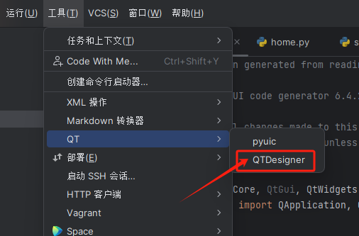
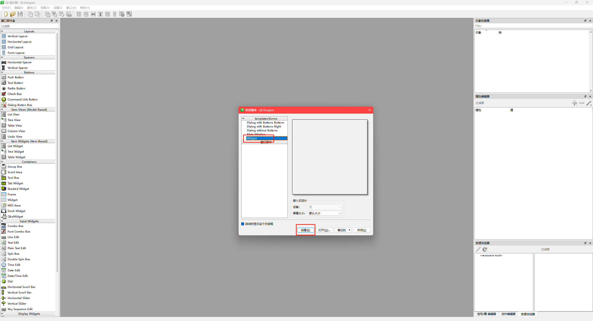
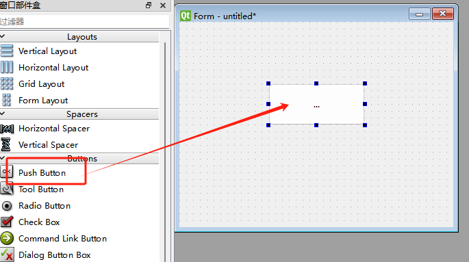
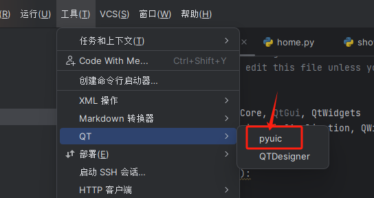
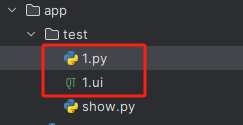

# PyQT6简介

PyQt是一个创建GUI应用程序的工具包。它有超过300类，将近6000个函数和方法。它是一个多平台的工具

包，可以运行在所有主要操作系统上。

## PyQt6和QTDesigner安装

### 安装PyQt6

PyQt6库是PyQt的开发库

```sh
pip install PyQt6 -i https://pypi.tuna.tsinghua.edu.cn/simple
```

### 安装pyqt6-tools

pyqt6-tools库是QTDesigner设计器工具支持库

```sh
pip install pyqt6-tools -i https://pypi.tuna.tsinghua.edu.cn/simple
```

## QTDesigner与PyUIC的配置

### 配置QTDesigner工具

QTDesigner是QT界面设计器，打开`Pycharm -> Settings -> Tools -> External Tools`，点击'+'，创建





Name: `QTDesigner`

Tool Settings -> Program: `写你Python3的安装目录下designer.exe路径，例如：E:\pyQt6\venv\Lib\site-packages\qt6_applications\Qt\bin\designer.exe`

### 配置PyUIC工具

PYUIC是用于将designer生成的ui文件转换成py文件，打开`Pycharm -> Settings -> Tools -> External Tools`，依旧点击 '+'，创建



program: `Python路径`

arguments：`-m PyQt6.uic.pyuic $FileName$ -o $FileNameWithoutExtension$.py`

working directory：`$FileDir$`

## QTDesigner与PyUIC的验证

### 验证QTDesigner

全部配置好之后，在上方导航栏中`Tools -> External Tools`能看到刚配置的工具，`External Tools`可以在是自定义名称，例如我自定义为: `QT`





能显示，说明`QTDesigner`安装成功。选Widget，创建，拖一个按钮进去。



### 验证PyUIC

保存ui文件到Python项目。然后先选中ui文件，再选`Tools -> PyUIC`，看到ui文件对应生成的python文件，就说明PyUIC配置成功。



