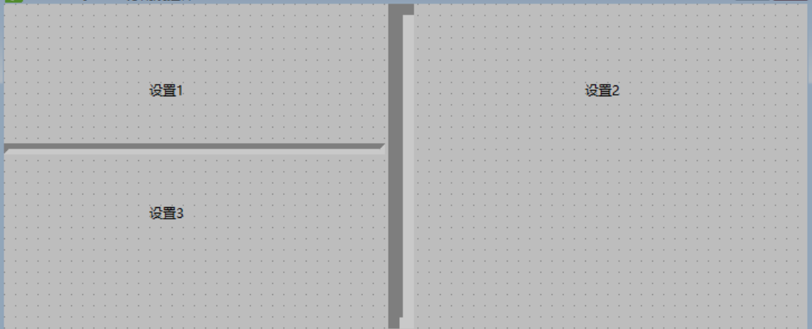
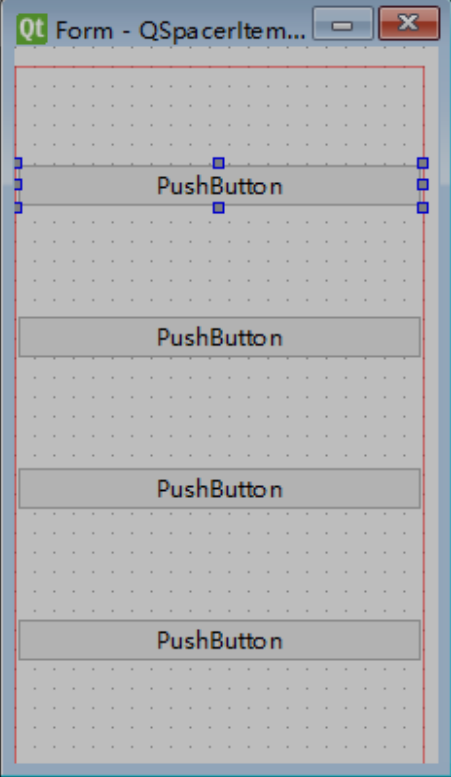
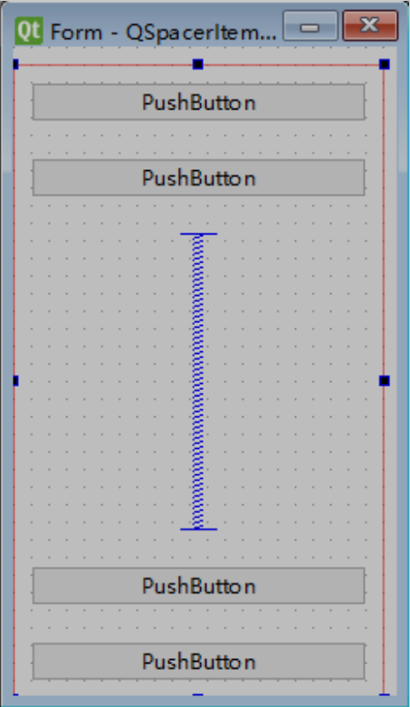
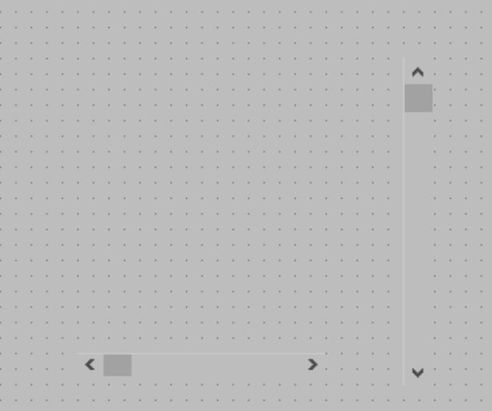

# QFrame分割线控件

PyQt6提供了两个分割线控件，分别是水平分割线HorizontalLine和垂直分割线VerticalLine，但这两个分割线控件对应的类都是QFrame类，该类提供了一个setFrameShape()方法，通过设置该方法的参数，可以将分割线显示为水平或者垂直。

| **方法**          | **说明**                                                     |
| ----------------- | ------------------------------------------------------------ |
| setFrameShape()   | 设置分割线方向，取值如下。 QFrame.Shape.HLine:水平分割线; QFrame.Shape.VLine:垂直分割线 |
| setFrameShadow()  | 设置分割线的显示样式，取值如下。 QFrame.Sunken:有边框阴影，并且下沉显示，这是默认设置; QFrame.Plain:无阴影; QFrame.Raised:有边框阴影，并且凸起显示 |
| setLineWidth()    | 设置分割线的宽度                                             |
| setMidLineWidth() | 设置分割线的中间线宽度                                       |

# QSpacerItem弹簧控件

PyQt6提供了两个弹簧控件，分别是HorizontalSpacer和VerticalSpacer，但这两个控件对应的类都是QSpacerItem类，水平和垂直主要通过宽度和高度（水平弹簧的默认宽度和高度分别是40、20，而垂直弹簧的默认宽度和高度分别是20、40）进行区分。

QSpacerItem弹簧主要用在布局管理器中，用来使布局管理器中的控件布局更加合理。

我们设计一个窗体，用垂直线性布局管理器，里面放四个按钮，默认是平分均等的位置划分布局。

假如我们需要中间空点。加了弹簧后，布局会更加合理。

# QDial旋钮控件

QDial旋钮控件，它本质上类似于一个滑块控件，只是显示的样式不同。

## QDial控件常用方法

| **方法**            | **说明**           |
| ------------------- | ------------------ |
| setFixedSize()      | 设置旋钮的大小     |
| setRange()          | 设置表盘的数值范围 |
| setMinimum()        | 设置最小值         |
| setMaximum()        | 设置最大值         |
| setNotchesVisible() | 设置是否显示刻度   |

- `notchSize : const int`

该属性保持当前的缺口大小。

缺口大小在范围控制单元中，而不是像素，并且如果可能的话，它是`singleStep（）`的倍数，导致在`notchTarget（）`附近的屏幕上的切口尺寸。

默认情况下，此属性的值为1。获取函数；`int notchSize() const`

- `notchTarget : qreal`

该属性拥有陷波之间的目标像素数。陷波目标是QDial尝试在每个陷波之间放置的像素数量。实际尺寸可能与目标尺寸不同。

默认陷波目标是3.7像素。获取函数；

`qreal notchTarget() const`

`void setNotchTarget(double target)`

- `notchesVisible : bool`

该属性保持是否显示切口。如果属性为true，则在刻度盘周围绘制一系列凹槽以指示可用值的范围; 否则没有显示缺口。

默认情况下，此属性被禁用。获取函数；

`bool notchesVisible() const`

`void setNotchesVisible(bool visible)`

- `wrapping : bool`

该属性保持是否启用包装。如果为true，则打开包装; 否则在表盘底部插入一些空格以分隔有效值范围的末端。如果启用，箭头的方向可以是任意角度。 如果禁用，箭头将被限制在拨号盘的上半部分; 如果它旋转到

刻度盘底部的空间中，它将被钳位到有效值范围的最近端。

默认情况下，该属性为false。获取函数；

`bool wrapping() const`

`void setWrapping(bool on)`

# QScrollBar滚动条控件

PyQt6提供了两个滚动条控件，分别是水平滚动条HorizontalScrollBar和垂直滚动条VerticalScrollBar，但这两个滚动条控件对应的类都是QScrollBar类，这两个控件通过水平的或垂直的滚动条，可以扩大当前窗口的有效装载面积，从而装载更多的控件。

## QScrollBar滚动条类的常用方法

| **方法**         | **说明**                                                     |
| ---------------- | ------------------------------------------------------------ |
| setMinimum()     | 设置滚动条最小值                                             |
| setMaximum()     | 设置滚动条最大值                                             |
| setOrientation() | 设置滚动条显示方向，取值如下。 Qt.Horizontal:水平滚动条; Qt.Vertical:垂直滚动条 |
| setValue()       | 设置滚动条的值                                               |
| value()          | 获取滚动条的当前值                                           |

滚动条控件通常与其他控件配合使用，如ScrollArea、TableWidget表格等，另外，也可以使用滚动条控件实现与滑块控件同样的功能，实际上，滚动条控件也是一种特殊的滑块控件。

