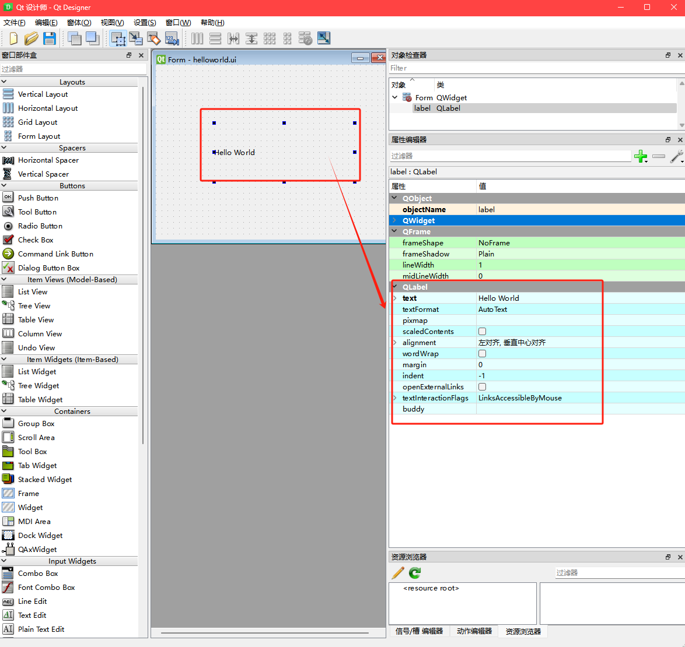

# QLabel标签控件

Label控件，又称为标签控件，它主要用于显示用户不能编辑的文本，标识窗体上的对象（例如，给文本

框、列表框添加描述信息等)，它对应PyQt6中的QLabel类，Label控件本质上是QLabel类的一个对象。

## Label属性

Label控件，又称为标签控件，它主要用于显示用户不能编辑的文本，标识窗体上的对象（例如，给文本

框、列表框添加描述信息等)，它对应PyQt6中的QLabel类，Label控件本质上是QLabel类的一个对象。

Display Widgets —> Label

在Qt Designer设计器的右边栏目中，可对`标签文本 text`，`标签文本对齐方式 alignment`，`开启文本换行 wordWrap`，`开启文本超链接 OpenExternalLinks`，`设置图片 Pixmap`等属性，进行设置。



## 获取Label文本

使用QLabel类的text()方法，获取Label标签中的文本

```python
import sys
from PyQt6.QtWidgets import QApplication, QLabel
from PyQt6 import uic

if __name__ == '__main__':
    app = QApplication(sys.argv)
    ui = uic.loadUi("./QLabel标签.ui")
    myLabel: QLabel = ui.label # 获取label对象
    print(myLabel.text()) # 打印label文本值
    ui.show()
    sys.exit(app.exec())
```

