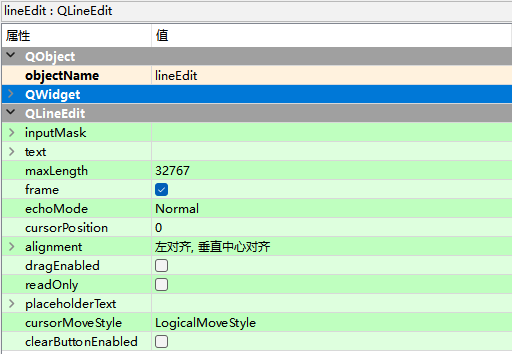

# QLineEdit单行文本框

QLineEdit是单行文本框，只能输入单行字符串。

Input Widgets —> Line Edit

| **方法**             | **说明**                                                     |
| -------------------- | ------------------------------------------------------------ |
| setText()            | 设置文本框内容                                               |
| text()               | 获取文本框内容                                               |
| setPlaceholderText() | 设置文本框浮显文字                                           |
| setMaxLength()       | 设置允许文本框内输入字符的最大长度                           |
| setAlignment()       | 设置文本对齐方式                                             |
| setReadOnly()        | 设置文本框只读                                               |
| setFocus()           | 使文本框得到焦点                                             |
| setEchoMode()        | 设置文本框显示字符的模式，有以下4种模式。 QLineEdit.Normal:正常显示输入的字符，这是默认设置； QLineEdit.NoEcho:不显示任何输入的字符(不是不输入，只是不显示）; QLineEdit.Password:显示与平台相关的密码掩码字符，而不是实际输入 的字符； QLineEdit.PasswordEchoOnEdit:在编辑时显示字符，失去焦点后显示 密码掩码字符 |
| setValidator()       | 设置文本框验证器，有以下3种模式。 QlntValidator:限制输入整数; QDoubleValidator:限制输入小数; QRegExpValidator:检查输入是否符合设置的正则表达式 |
| setInputMask()       | 设置掩码，掩码通常由掩码字符和分隔符组成，后面可以跟一个分号和 空白字符，空白字符在编辑完成后会从文本框中删除，常用的掩码有以 下几种形式。 日期掩码:0000-00-00; 时间掩码:00:00:00; 序列号掩码:>AAAAA-AAAAA-AAAAA-AAAAA-AAAAA;# |
| clear()              | 清除文本框内容                                               |

