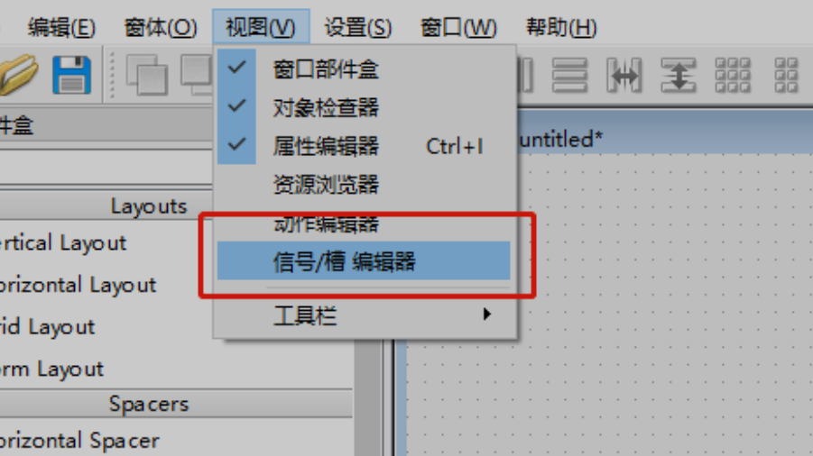

# 基类QObject类介绍以及应用

QObject是Qt库中最重要的类之一。作为所有Qt类的基类，QObject提供了信号槽机制、对象树、动态属性、元对象系统、事件处理机制、线程安全、国际化等许多重要特性，这些特性可以帮助开发者轻松实现模块间通信、组件化、程序设计以及事件处理等方面的功能。

在Qt框架下编程，不管用不用到Qt的特性，都推荐自定义类继承QObject类，这样在需要的时候，就可以随时使用Qt基于QObject类提供的各种特性和机制，而且可以让自定义的类很好地融入到Qt的框架之

中。

## QObject特性

### 信号槽机制

QObject通过定义信号（signal）和槽（slot）来实现对象间的通信。当信号被触发时，与该信号相对应注册的槽函数将会被自动调用。一个信号可以连接到多个槽函数上，也可以将多个信号连接到同一个槽函数。信号/槽机制是Qt中最强大和最独特的功能之一，可以帮助开发者在不同的对象之间进行通信，处理事件等。

### 对象树
QObject支持管理对象树结构的方式。它允许对象包含一个父对象和零个或多个子对象。当父对象被删除时，其所有子对象也会被自动销毁。这个特性使得我们在Qt程序中组织和管理QObject及其子类之间的依赖关系变得更容易。

### 动态属性
QObject支持添加动态属性。这意味着，除了一组已经存在的静态属性之外，每个对象实例还可以动态地创建和设置新的属性，这些属性不需要在编译器层面进行定义和声明。这种灵活性使得QObject能够适应各种场景的需求。

### 元对象系统
元对象系统（Meta-Object System）是QObject的另一个重要特性。它为每个QObject和其子类提供运行时类型信息，包括对象的类名、属性、方法和信号等信息，这些信息都可以在运行时被访问或者修改。元对象系统赋予了Qt框架独特的能力，例如能够自动序列化和反序列化对象以及其成员等，同时也是实现Qt信号槽机制的关键技术。

### 事件处理机制
QObject支持通过发送和接收事件来实现对象间的通信。Qt中的事件是指某种对象发生的一些动作或状态变化，通常包含一个事件类型和一些参数。QObject可以捕获并处理各种类型的事件，也可以派发（dispatch）事件给其他对象进行处理。

### 线程安全
QObject被设计为线程安全的基础构建单元。这意味着QObject默认可以在多线程环境下直接使用，而无需考虑同步问题。但是，如果需要在不同线程之间交互对象，还是需要小心地设计和管理线程模型。

### 国际化
QObject提供国际化（Internationalization / i18n）函数，帮助开发人员使应用程序能够方便地本地化，支持多语言切换。i18n函数提供消息翻译，日期和时间格式化以及数字格式转换等功能。

QObject setObjectName()方法 设置对象名称，理论上不可以重复。我们再给控件设置样式的时候，可以用到这个对象属性

setProperty()方法可以给对象添加属性以及属性值。我们qss样式里面可以细化指定属性来设置样式，来实现设置归类样式。

## 信号与槽

信号槽是 Qt 框架引以为豪的机制之一。所谓信号槽，实际就是观察者模式。当某个事件发生之后，比如，按钮检测到自己被点击了一下，它就会发出一个信号（signal）。这种发出是没有目的的，类似广播。如果有对象对这个信号感兴趣，它就会使用连接（connect）函数，意思是，将想要处理的信号和自己的一个函数（称为槽（slot））绑定来处理这个信号。也就是说，当信号发出时，被连接的槽函数会自动被回调。

一个信号可以连接到多个槽函数上，也可以将多个信号连接到同一个槽函数。

这个槽的话，也分两种，一种是不同控件内置的槽函数，还有一种是我们自己定义的槽函数。

## QTimer计时器控件

在PyQt6中，如果需要周期性地执行某项操作，就可以使用QTimer类实现，QTimer类表示计时器，它可以定期发射timeout信号，时间间隔的长度在start()方法中指定，以毫秒为单位，如果要停止计时器，则需要使用stop()方法