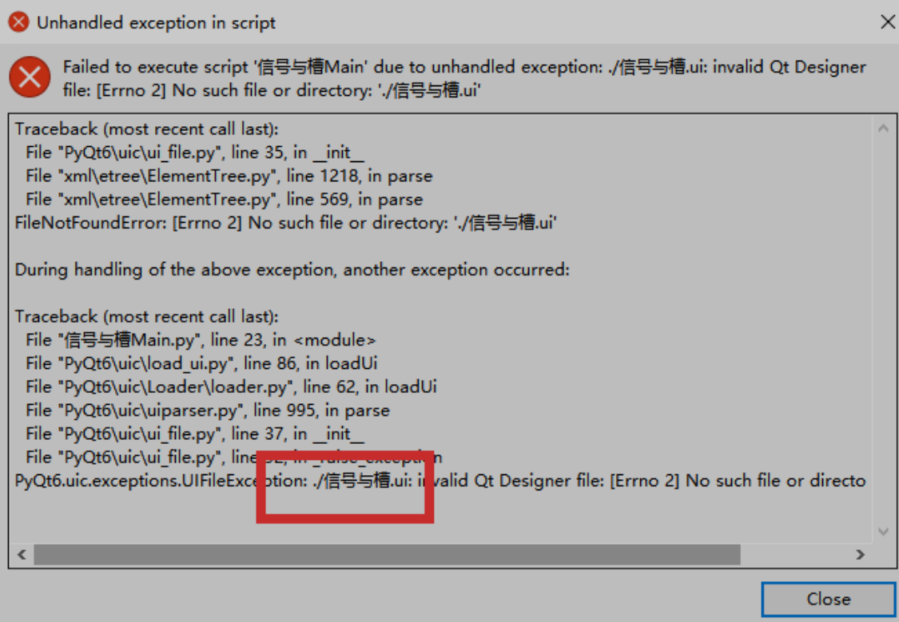

# Pyinstaller打包

PyQt6程序的打包发布，即将.py代码文件打包成可以直接双击执行的.exe文件，在Python中并没有内置可以直接打包程序的模块，而是需要借助第三方模块实现。打包Python程序的第三方模块有很多，其中最常用的就是Pyinstaller。

安装Pyinstaller

```sh
pip install Pyinstaller -i https://pypi.tuna.tsinghua.edu.cn/simple
```

## 打包普通Python程序

普通Python程序指的是完全使用Python内置模块或者对象实现的程序，程序中不包括任何第三方模块。

使用Pyinstaller打包普通Python程序的步骤如下。

1. 打开系统的CMD命令窗口，使用cd命令切换到.py文件所在路径（如果.py文件不在系统盘C盘，需要先

2. 使用“盘符:”命令来切换盘符），然后输入“pyinstaller -F 文件名.py”命令进行打包

下面是一些常用的命令行选项：

`-F：将所有文件打包为一个单独的可执行文件。`

`-D：将所有文件打包为一个目录，包含可执行文件和所有依赖的文件。`

`-c：将程序与命令提示符结合在一起，以便在命令提示符下运行。`

`-d：将调试信息打包进可执行文件中。`

`–onefile：将所有文件打包为一个单独的可执行文件。`

`-o：指定输出文件的位置。`

`-w：打包为窗口文件。`

`-p DIR, –path=DIR：设置导入路径，从而导入需要的模块`

3. 打包命令：

```sh
pyinstaller -F helloworld.py
```

4. dist目录，可以找到打包生成的 helloworld.exe 可执行文件。

## 打包PyQt6程序

前面使用“pyinstaller -F”命令可以打包没有第三方模块的普通Python程序，但如果程序中用到了第三方模块，在运行打包后的.exe文件时就会出现找不到相应模块的提示。

我们就以打包PyQt6程序为例进行详细讲解。

PyQt6是一个第三方的模块，可以设计窗口程序，因此在使用pyinstaller命令打包其开发的程序时，需要使用--paths指定PyQt6模块所在的路径；另外，由于是窗口程序，所以在打包时需要使用-w指定打包的是窗口程序，还可以使用--icon指定窗口的图标。

```sh
pyinstaller --paths PyQt6模块路径 -F -w --icon=窗口图标文件 文件名.py
```

参数说明：

- `--paths：指定第三方模块的安装路径。`

- `-w：表示窗口程序。`

- `--icon：可选项，如果设置了窗口图标，则指定相应文件路径；如果没有，则省略。`

- 文件名.py：窗口程序的入口文件。

我们打包以前学习的加法程序。

```sh
pyinstaller --paths D:\python\python3\Lib\site-packages\PyQt6\Qt6\bin -F -w --icon=favicon32.ico 信号与槽Main.py
```



执行报错，找不到ui文件。这里注意，所有的项目资源文件，包括Ui，图片等资源文件，都要放到dist目录下。