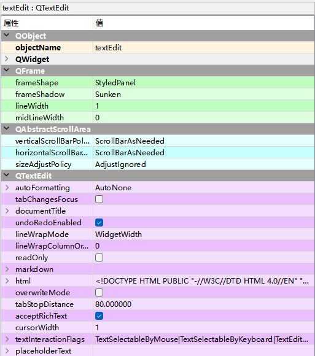

#  QTextEdit多行富文本框

QTextEdit是多行文本框控件，主要用来显示多行的文本内容，当文本内容超出控件的显示范围时，该控

件将显示垂直滚动条；另外，QTextEdit控件不仅可以显示纯文本内容，还支持显示HTML网页。

Input Widgets —> Text Edit

| **方法**                 | **描述**                                                     |
| ------------------------ | ------------------------------------------------------------ |
| setPlainText(）          | 设置文本内容                                                 |
| toPlainText()            | 获取文本内容                                                 |
| setTextColor()           | 设置文本颜色，例如，将文本设置为红色，可以将该方法的参数设 置为QtGui.QColor(255,0,0) |
| setTextBackgroundColor() | 设置文本的背景颜色，颜色参数与setTextColor()相同             |
| setHtml()                | 设置 HTML文档内容                                            |
| toHtml()                 | 获取HTML文档内容                                             |
| setLineWrapMode()        | lineWrapMode：lineWrapMode属性用于控制换行模式，其类型 为枚举类型QTextEdit.LineWrapMode，缺省值为WidgetWidth， 表示以词为单位在编辑器右边换行，换行出现在空白处，保持整个 单词的完整性。可以调用方法lineWrapMode()、 setLineWrapMode(）来访问该属性。如果设置换行模式为 FixedPixelWidth（距离控件左侧的像素距离） 或 FixedColumnWidth(距离控件左侧的列距离) ，同时需要调用 setLineWrapColumnOrWidth()方法设置换行的像素宽度或字符数 宽度，这两种模式不会保持单词的完整性 |
| clear()                  | 清除所有内容                                                 |
| overwriteMode()          | overwriteMode属性用于控制用户输入文本是否替换现有文本，如 果为True，则输入字符从当前光标位置开始逐一替换当前的字符， 为False则在光标处插入输入字符。缺省值为False，可以通过方法 overwriteMode()、setOverwriteMode(）进行访问 |

