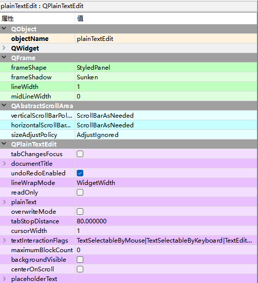

# QPlainTextEdit纯文本

QPlainTextEdit纯文本控件，主要用来显示多行的文本内容

Input Widgets —> Plain Text Edit

| **方法**          | **描述**                                                     |
| ----------------- | ------------------------------------------------------------ |
| setPlainText(）   | 设置文本内容                                                 |
| toPlainText()     | 获取文本内容                                                 |
| setLineWrapMode() | lineWrapMode：lineWrapMode属性用于控制换行模式，其类型为枚举 类型QTextEdit.LineWrapMode，缺省值为WidgetWidth，表示以词为单 位在编辑器右边换行，换行出现在空白处，保持整个单词的完整性。可以 调用方法lineWrapMode()、setLineWrapMode(）来访问该属性。 |
| clear()           | 清除所有内容                                                 |
| overwriteMode()   | overwriteMode属性用于控制用户输入文本是否替换现有文本，如果为 True，则输入字符从当前光标位置开始逐一替换当前的字符，为False则 在光标处插入输入字符。缺省值为False，可以通过方法 overwriteMode()、setOverwriteMode(）进行访问 |

