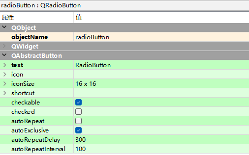
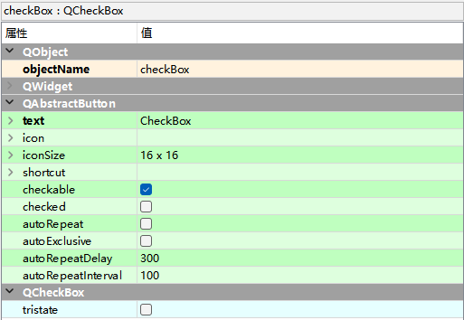
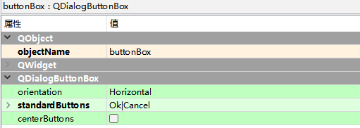

# QRadioButton单选按钮

它为用户提供由两个或多个互斥选项组成的选项集，当用户选中某单选按钮时，同一组中的其他单选按钮不能同时选定。

Buttons -> Radio Button

## QRadioButton类的常用方法

| **方法**                         | **说明**                                                     |
| -------------------------------- | ------------------------------------------------------------ |
| setText()                        | 设置单选按钮显示的文本                                       |
| text()                           | 获取单选按钮显示的文本                                       |
| setChecked() 或者 setCheckable() | 设置单选按钮是否为选中状态，True为选中状态，False为未选中状态 |
| isChecked()                      | 返回单选按钮的状态，True为选中状态，False为未选中状态        |

# QCheckBox复选框按钮

QCheckBox是复选框控件，它用来表示是否选取了某个选项条件，常用于为用户提供具有是／否或真／假值的选项。

QCheckBox控件的使用与QRadioButton控件类似，但它是为用户提供“多选多”的选择，另外，它除了选中和未选中两种状态之外，还提

供了第三种状态：半选中。如果需要第三种状态，需要使用QCheckBox类的setTristate()方法使其生效，并且可以使用checkState()方法查

询当前状态。

CheckBox控件的三种状态值及说明:

| 方法                | **说明** |
| ------------------- | -------- |
| QT.Checked          | 选中     |
| QT.PartiallyChecked | 半选中   |
| QT.Unchecked        | 未选中   |

# QDialogButtonBox组合按钮控件

QDialogButtongBox 是一个包含很多按钮的控件，对话框中有多个需要分组排列的按钮时，可以使用QDialogButtongBox类。

开发人员可以向 QDialogButtonBox 添加按钮， QDialogButtonBox 会根据平台自动使用合适的布局。

