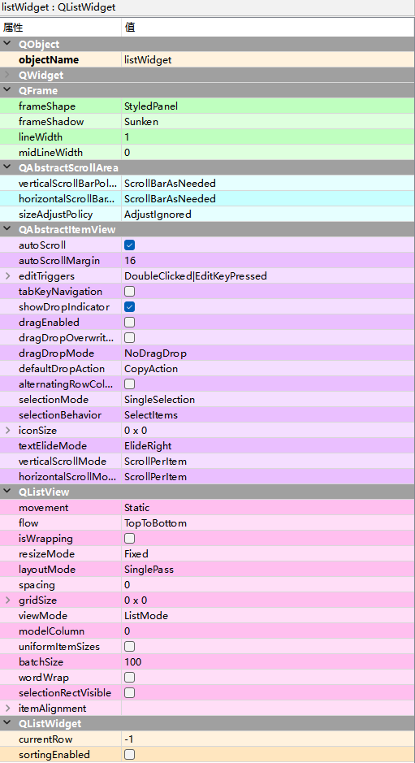

# QListWidget列表

`PyQt6`提供了两种列表，分别是`QListWidget`和`QListView`，其中，`QListView`是基于模型的，它是`QListWidget`的父类，使用`QListView`时，首先需要建立模型，然后再保存数据；

而`QListWidget`是`QListView`的升级版本，它已经内置了一个数据存储模型`QListWidgetItem`，我们在使用时，不必自己建立模型，而直接使用`addItem()`或者`addItems()`方法即可添加列表项。所以在实际开发时，推荐使用`QListWidget`控件作为列表

item Widgets(item-Based) -> Font Combo Box

## QListWidget常用方法

| **方法** |    **说明**  |
| -------- | ---- |
|  addItem() |向列表中添加项      |
|addItems()          |一次向列表中添加多项      |
|insertItem()          |在指定索引处插入项      |
|setCurrentItem()          |设置当前选择项      |
|item.setToolTip()          |设置提示内容      |
|item.isSelected()          |判断项是否选中      |
|setSelectionMode()          | 设置列表的选择模式，支持以下5种模式。 QAbstractItemView.NoSelection:不能选择; QAbstractItemView.SingleSelection:单选; QAbstractItemView.MultiSelection:多选; QAbstractItemView.ExtendedSelection:正常单选，按Ctrl或者Shift键 后，可以多选; QAbstractltemView.ContiguousSelection:与 ExtendedSelection类似 |
| setSelectionBehavior() | 设置选择项的方式，支持以下3种方式。 QAbstractItemView.SelectItems:选中当前项; QAbstractltemView.SelectRows:选中整行; OAbstractltemView.SelectColumns:选中整列 |
| setWordWrap() | 设置是否自动换行，True表示自动换行，False表示不自动换行 |
| setViewMode() | 设置显示模式，有以下两种显示模式。 QListView.ListMode:以列表形式显示; QListView.IconMode:以图表形式显示 |
| item.text() | 获取项的文本 |
| clear() | 删除所有列表项 |

