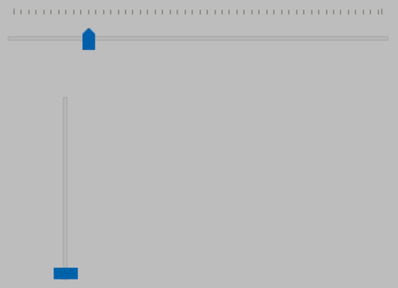

# QProgressBar进度条控件

QProgressBar控件表示进度条，通常在执行长时间任务时，用进度条告诉用户当前的进展情况。

## QProgressBar类的常用方法

| **方法**                | **说明**                                                     |
| ----------------------- | ------------------------------------------------------------ |
| setMinimum()            | 设置进度条的最小值，默认值为0                                |
| setMaximum()            | 设置进度条的最大值，默认值为99                               |
| setRange()              | 设置进度条的取值范围，相当于setMinimum()和 setMaximum)的结合 |
| setValue()              | 设置进度条的当前值                                           |
| setFormat()             | 设置进度条的文字显示格式，有以下3种格式。 %p%:显示完成的百分比，默认格式; %v:显示当前的进度值; %m:显示总的步长值 |
| setLayoutDirection()    | 设置进度条的布局方向，支持以下3个方向值。 Qt.LeftToRight:从左至右; Qt.RightToLeft:从右至左; Ot.LayoutDirectionAuto:跟随布局方向自动调整 |
| setAlignment()          | 设置对齐方式，有水平和垂直两种，分别如下。 ◆水平对齐方式 Qt.AlignLeft:左对齐; Qt.AlignHCenter:水平居中对齐; Qt.AlignRight:右对齐; Qt.AlignJustify:两端对齐; ◆垂直对齐方式 Qt.AlignTop:顶部对齐; Qt.AlignVCenter:垂直居中; Qt.AlignBottom:底部对齐 |
| setOrientation()        | 设置进度条的显示方向，有以下两个方向。 Qt.Horizontal:水平方向; Ot.Vertical:垂直方向 |
| setInvertedAppearance() | 设置进度条是否以反方向显示进度                               |
| setTextDirection()      | 设置进度条的文本显示方向，有以下两个方向。 QProgressBar.TopToBottom:从上到下; QProgressBar.BottomToTop:从下到上 |
| setProperty()           | 对进度条的属性进行设置，可以是任何属性，如：self.progressBar.setProperty("value" , 24) |
| minimum()               | 获取进度条的最小值                                           |
| maximum()               | 获取进度条的最大值                                           |
| value()                 | 获取进度条的当前值                                           |

#  QSlider滑块控件

PyQt6提供了两个滑块控件，分别是水平滑块HorizontalSlider和垂直滑块VerticalSlider，但这两个滑块控件对应的类都是QSlider类，该类提供了一个setOrientation()方法，通过设置该方法的参数，可以将滑块显示为水平或者垂直。

比如我们在设置字体大小，就可以通过滑块来动态设置显示字体，这样用户体验更好，包括头像大小等，可以用到滑块。

## QSlider滑块类的常用方法

| **方法**          | **说明**                                                     |
| ----------------- | ------------------------------------------------------------ |
| setMinimum()      | 设置滑块最小值                                               |
| setMaximum()      | 设置滑块最大值                                               |
| setOrientation()  | 设置滑块显示方向，取值如下。 Qt.Horizontal:水平滑块; Qt.Vertical:垂直滑块 |
| setPageStep()     | 设置步长值，通过鼠标单击滑块时使用                           |
| setSingleStep()   | 设置步长值，通过鼠标拖动滑块时使用                           |
| setValue()        | 设置滑块的值                                                 |
| setTickInterval() | 设置滑块的刻度间隔                                           |
| setTickPosition() | 设置滑块刻度的标记位置，取值如下。 QSlider.NoTicks:不显示刻度，这是默认设置; QSlider.TicksBothSides:在滑块的两侧都显示刻度; QSlider.TicksAbove:在水平滑块的上方显示刻度; QSlider.TicksBelow:在水平滑块的下方显示刻度; QSlider.TicksLeft:在垂直滑块的左侧显示刻度; QSlider.TicksRight:在垂直滑块的右侧显示刻度 |
| value()           | 获取滑块的当前值                                             |

