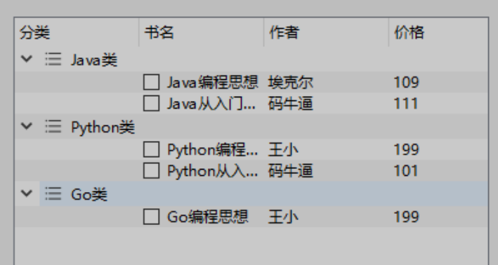

# QTreeWidget树

QTreeWidget树控件，它提供了一个使用预定义树模型的树视图，它的每一个树节点都是一个QTreeWidgetItem。

由于QTreeWidget类继承自QTreeView，因此，它具有QTreeView的所有公共方法，另外，它还提供了一些自身特有的方法。

## QTreeWidget类的常用方法

| **方法**              | **说明**                   |
| --------------------- | -------------------------- |
| addTopLevelltem()     | 添加顶级节点               |
| insertTopLevelltems() | 在树的顶层索引中插入节点   |
| invisibleRootItem()   | 获取树控件中不可见的根选项 |
| setColumnCount()      | 设置要显示的列数           |
| setColumnWidth()      | 设置列的宽度               |
| selectedItems()       | 获取选中的树节点           |

## QTreeWidgetItem类的常用方法

| **方法**        | **说明**                                                     |
| --------------- | ------------------------------------------------------------ |
| addChild()      | 添加子节点                                                   |
| setText()       | 设置节点的文本                                               |
| setCheckState() | 设置指定节点的选中状态，取值如下。 Qt.Checked:节点选中; Qt.Unchecked:节点未选中 |
| setIcon()       | 为节点设置图标                                               |
| text()          | 获取节点的文本                                               |

