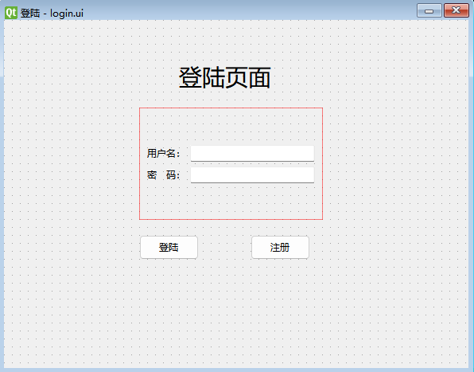

# 登陆

## 绘制画面



1. 打开`QtDesigner`，选择`Widget`即可，因为不需要状态栏之类的属性，修改窗口名`QWidget —> windowTitle`。

2. 使用表单布局`Form Layout`。

3. 标题`Label`，图标`QLabel -> pixmap`，图标缩放`QLabel -> scaledContents`

4. 用户名`Label`，用户名输入框`Line Edit`

5. 密码`Label`，密码输入框`Line Edit`，改为密文`QLineEdit -> echoMode : password`。

6. 按钮`Push Button`，加载图标`QA bstractButton -> icon`

7. 为了方便代码和画面相对应，需修改`对象检测器`中的`栏位属性名`


## 代码

1. 使用`pyuic`将`ui文件`转为`py代码`

2. `ctrl+O` 生成`__init__`方法

```python
    def __init__(self):
        super(Ui_Form, self).__init__()
        self.setupUi(self)
```

3. 主方法

```python
if __name__ == '__main__':
    app = QApplication(sys.argv)
    ui = Ui_Form()
    ui.show()
    sys.exit(app.exec())
```

4. 按钮方法

实现功能，点击按钮，会清空表单数据

```python
    def resetForm(self):
        print("resetForm")
        self.usernameInput.setText("")
        self.passwordInput.setText("")
```

5. 绑定按钮

将写好的按钮方法和signBtn按钮进行绑定，点击按钮，就会执行按钮方法

```python
        #绑定按钮
        self.signBtn.clicked.connect(self.resetForm)
```

6. 完整代码