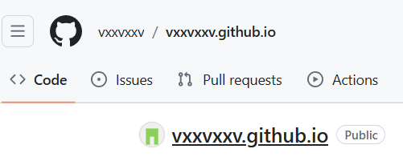
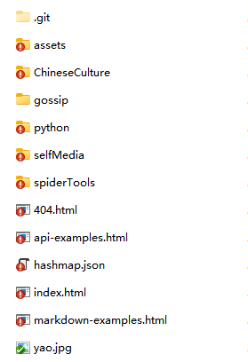
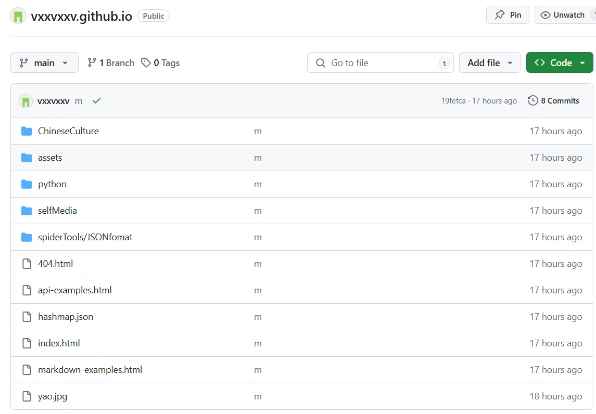
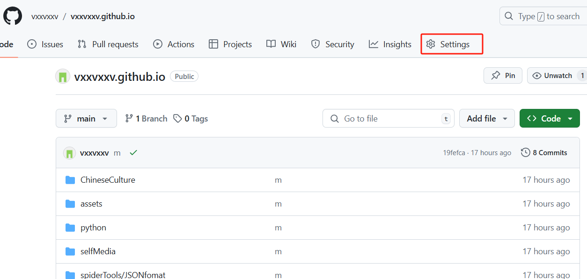
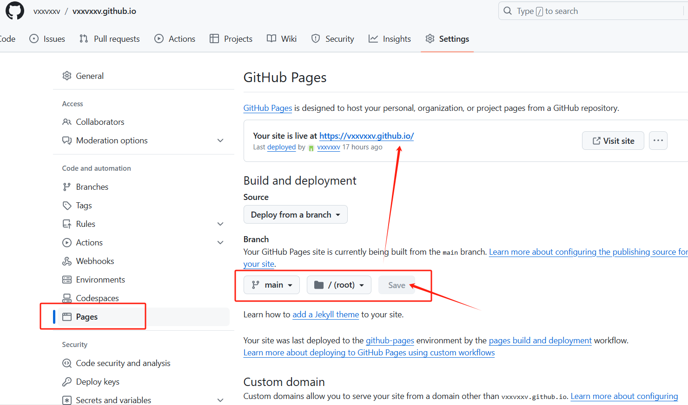

# GitHub部署学习

部署在GitHub Pages，之后可发布到其他社交平台，或者仅自己保存，翻阅学习。

:::warning 注意

确保你已经创建了 VitePress 项目并进行了基本的配置和开发。并且，你的项目可以正常地在本地运行和预览。

:::

## 创建GitHub仓库

在 GitHub 上创建一个新的仓库，命名为 &lt;username&gt;.github.io。

其中 &lt;username&gt; 是你的 GitHub 用户名。这个特殊命名的仓库用于托管 GitHub Pages 的内容。



## 构建项目

VitePress 项目终端中执行

```sh
npm run docs:build
```

## 上传至Git

将项目构建之后生成的`dist` 文件夹中的内容，路径为 `你的项目\docs\.vitepress\dist `，不包括 `dist` 文件夹，提交到刚创建的仓库。



## 部署



## 问题

:::tip 部署后，访问链接后，发现样式未生效

检查项目config.mts文件中，是否配置`base`属性。

如果有配置，那么要确保`base`属性的字段和github仓库名保持一致。

:::

:::tip 部署后，发现链接为`https://你的仓库名.github.io/你的项目名/`

如果在项目config.mts文件中，配置了`base`属性，以及git仓库名命名和`base`属性的字段保持一致。

那么可能会出现该情况。

如果想部署后的访问链接为`https://你的仓库名.github.io/`，可以省略配置`base`属性，以及git仓库，命名为 &lt;username&gt;.github.io。

其中 &lt;username&gt; 是你的 GitHub 用户名

:::

