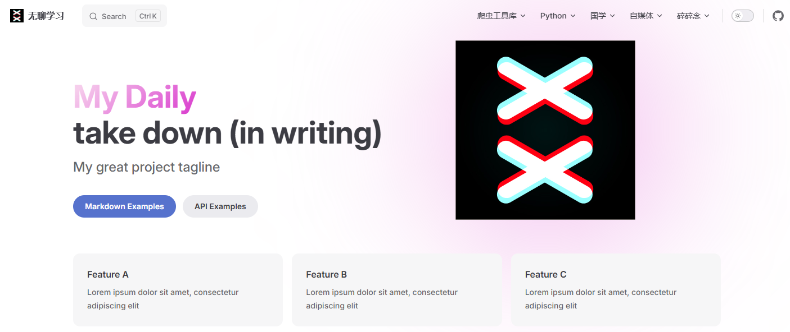
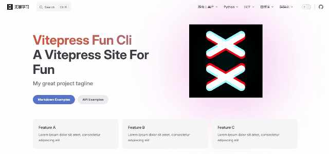

# 首页美化

首页美观，可以引人注目，加深印象。

## 首页图标和标题渐变

::: tip 感谢提供思路

作者：吴老头
链接：https://juejin.cn/post/7133165263767207966
来源：稀土掘金

:::



`.vitepress`目录下创建`theme`目录，`theme`目录下创建`index.ts`，输入以下内容

```ts
import Theme from 'vitepress/theme'

export default {
  ...Theme
}
```

`theme`目录下创建`style`目录，`style`目录下创建`var.css`

```css
:root {
  --vp-home-hero-name-color: red;
}
```

`theme/index.ts`下引入`style/var.css`

```ts
import Theme from 'vitepress/theme'
import './style/var.css'

export default {
  ...Theme
}
```

通过css实现渐变色，渐变色可以从[这个网站](https://link.juejin.cn?target=https%3A%2F%2Fwebkul.github.io%2Fcoolhue%2F)获取

```css
:root {
  /* 标题 */
  --vp-home-hero-name-color: transparent;
  --vp-home-hero-name-background: linear-gradient( 135deg, #F6CEEC 10%, #D939CD 100%);
  
  /* 图标背景 */
  --vp-home-hero-image-background-image: linear-gradient( 135deg, #F6CEEC 10%, #D939CD 100%);
  --vp-home-hero-image-filter: blur(150px);
}
```

## 首页标题动态渐变

::: tip 感谢提供思路

作者：吴老头
链接：https://juejin.cn/post/7208188347864760357
来源：稀土掘金

:::



### 使用插槽`home-hero-info`

先创建需要的组件，`docs/theme/components/AnimateTitle.vue`

```html
<script setup lang="ts"></script>

<template>
  <h1 class="name">
    <span class="clip">Vitepress Fun Cli</span>
  </h1>
  <p class="text">A Vitepress Site For Fun</p>
  <p class="tagline">My great project tagline</p>
</template>

<style scoped>
.name {
  background: -webkit-linear-gradient(
    315deg,
    rgb(210, 86, 53) 10%,
    #647eff 50%,
    rgb(238, 224, 112) 90%
  );
  background-clip: text;
  -webkit-background-clip: text;
  -webkit-text-fill-color: transparent;

  background-size: 400% 400%;
  animation: gradient 5s ease infinite;
}

@keyframes gradient {
  0% {
    background-position: 0% 50%;
  }

  50% {
    background-position: 100% 50%;
  }

  100% {
    background-position: 0% 50%;
  }
}

.name,
.text {
  max-width: 392px;
  letter-spacing: -0.4px;
  line-height: 40px;
  font-size: 32px;
  font-weight: 700;
  white-space: pre-wrap;
}
@media (min-width: 640px) {
  .name,
  .text {
    max-width: 576px;
    line-height: 56px;
    font-size: 48px;
  }
}
@media (min-width: 960px) {
  .name,
  .text {
    line-height: 64px;
    font-size: 56px;
  }
}

.tagline {
  padding-top: 8px;
  max-width: 392px;
  line-height: 28px;
  font-size: 18px;
  font-weight: 500;
  white-space: pre-wrap;
  color: var(--vp-c-text-2);
}
@media (min-width: 640px) {
  .tagline {
    padding-top: 12px;
    max-width: 576px;
    line-height: 32px;
    font-size: 20px;
  }
}

@media (min-width: 960px) {
  .tagline {
    line-height: 36px;
    font-size: 24px;
  }
}
</style>


```

安装`vue`，执行命令`pnpm add vue`

在之前创建的文件`theme/index.ts`，使用插槽，配置内容如下：

```ts
import Theme from "vitepress/theme";
import { h } from "vue";
import AnimateTitle from "./components/AnimateTitle.vue";

export default {
  ...Theme,
  Layout() {
    return h(Theme.Layout, null, {
      "home-hero-info": () => h(AnimateTitle),
    });
  },
};
```

