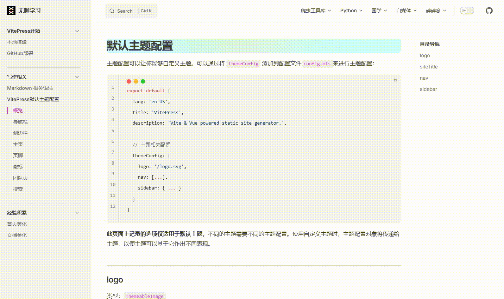

# 文档美化

主要涉及到侧边栏颜色自定义，以及标题背景自定义，以及鼠标放到代码块上，会出现炫彩跑马灯。

::: tip 致谢

感谢[刘龙彬](https://space.bilibili.com/385854392)老师提供的vitepress主题@escook/vitepress-theme`

:::

::: tip 点击查看

[点击查看网站具体效果](https://vxxvxxv.github.io/selfMedia/vitepress/32)

:::



## 侧边栏颜色自定义

通过修改对应css即可，在`\.vitepress\theme\style\`下创建`style.css`文件，添加css：

```css
  :root {
          /* 主题基色 */
        --vp-c-brand: #D939CD;
        --vp-c-brand-1: #D939CD;
        --vp-c-brand-2: #D939CD;
        --vp-c-brand-3: #D939CD;
  }
```

## 标题背景自定义

在刚刚创建的`style.css`文件，添加css：

```css
  @property --anix {
      syntax: "<angle>";
      inherits: false;
      initial-value: 0deg;
  }  

  @keyframes rotatingx {
      0% {
          --anix: 0deg
      }
  
      to {
          --anix: 360deg
      }
  }

.vp-doc h1 {
      background: conic-gradient(from var(--anix), #0f0, #ff0, #0ff, #f0f, #0ff);
      backdrop-filter: blur(100px);
      opacity: .99;
      animation: rotatingx 5s linear infinite reverse;
      border-radius: 0.6rem;
  }
  
  .vp-doc h1:before {
      content: " ";
      width: 100%;
      height: 100%;
      background: rgba(255, 255, 255, 0.8);
      backdrop-filter: blur(100px);
      position: absolute;
      left: 0;
      top: 0;
      z-index: -1;
      border-radius: 0.5rem;
  }

//暗系主题.dark
  .dark   .vp-doc h1:before {
    content: " ";
    width: 100%;
    height: 100%;
    background: rgba(0, 0, 0, 0.8);
    backdrop-filter: blur(100px);
    position: absolute;
    left: 0;
    top: 0;
    z-index: -1;
    border-radius: 0.5rem;
}
```

## 代码块炫彩跑马灯

`style.css`文件，添加css：

```css
   @property --anix {
      syntax: "<angle>";
      inherits: false;
      initial-value: 0deg;
  }  

  @keyframes rotatingx {
      0% {
          --anix: 0deg
      }
  
      to {
          --anix: 360deg
      }
  }

.vp-doc .vp-adaptive-theme {
      border: 2px solid #313d44;
      border-radius: 8px;
      border-color: transparent;
      position: relative
  }
  
  .vp-doc .vp-adaptive-theme.active {
      margin-bottom: 0
  }
  
   .vp-doc .vp-adaptive-theme:not(.vp-code-group .vp-adaptive-theme) {
      border-top: 2px solid transparent
  }
  
   .vp-doc .vp-adaptive-theme:not(.vp-code-group .vp-adaptive-theme):hover {
      border-color: transparent;
      background-clip: border-box;
      background: conic-gradient(from var(--anix), #0f0, #ff0, #0ff, #f0f, #0ff);
      backdrop-filter: blur(100px);
      opacity: .99;
      animation: rotatingx 5s linear infinite reverse
  }
  
  .vp-doc .vp-adaptive-theme:before {
      content: " ";
      width: 100%;
      height: 100%;
      background: rgba(255, 255, 255, 0.96);
      backdrop-filter: blur(100px);
      position: absolute;
      left: 0;
      top: 0;
      z-index: -1;
      border-radius: 8px
  }
  
  .dark .vp-doc .vp-adaptive-theme:before {
      content: " ";
      width: 100%;
      height: 100%;
      background: rgba(22, 22, 22);
      position: absolute;
      left: 0;
      top: 0;
      z-index: -1;
      border-radius: 8px
  }
```

